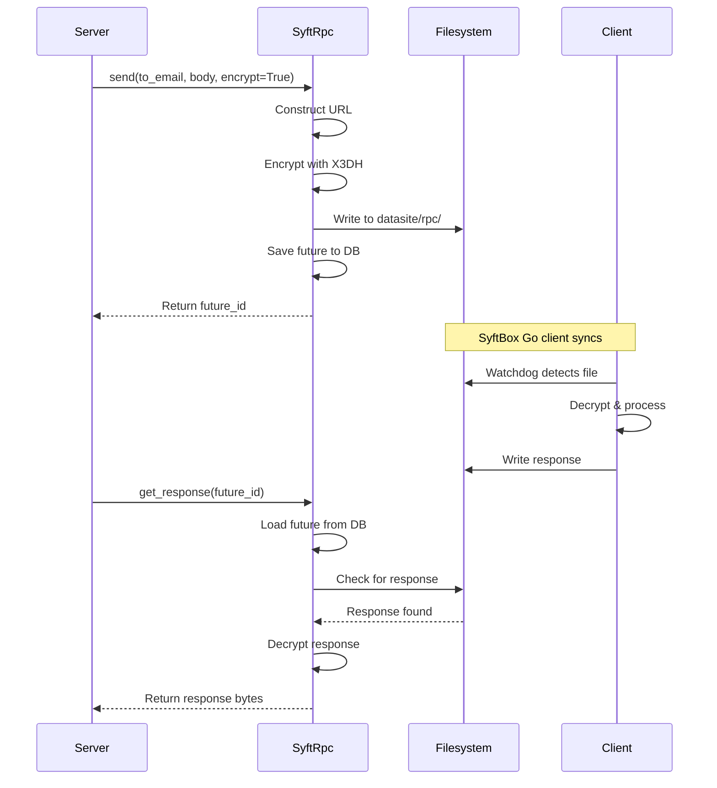
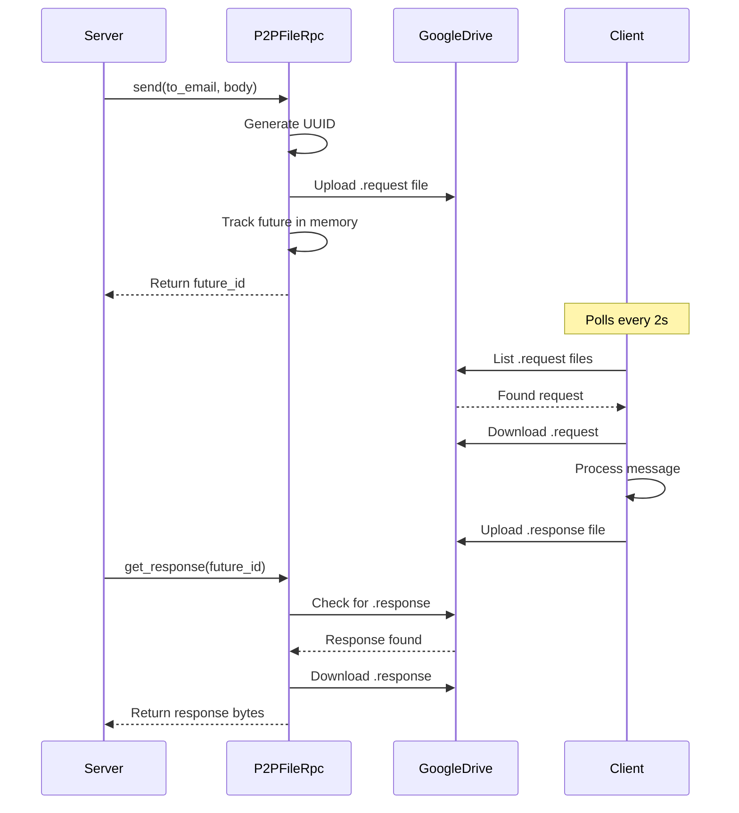

The RPC protocol provides a unified interface for sending and receiving FL messages across different transport implementations.

## SyftFlwrRpc Protocol

Base protocol defining the RPC interface for message transport.

### Interface Definition

```python
from abc import ABC, abstractmethod
from typing import Optional

class SyftFlwrRpc(ABC):
    """Protocol for syft-flwr RPC implementations.
    
    This abstraction allows syft-flwr to work with different
    transport mechanisms for sending FL messages:
    - syft_core: syft_rpc (using SyftBox Go Client) with futures database
    - syft_client: P2P File-based RPC via Google Drive sync
    """
```

**Source:** `src/syft_flwr/rpc/protocol.py:5`

### Methods

#### send

```python
@abstractmethod
def send(
    self,
    to_email: str,
    app_name: str,
    endpoint: str,
    body: bytes,
    encrypt: bool = False,
) -> str
```

Send a message to a recipient.

<ParamField path="to_email" type="str" required>
  Recipient's email address
</ParamField>

<ParamField path="app_name" type="str" required>
  Name of the FL application
</ParamField>

<ParamField path="endpoint" type="str" required>
  RPC endpoint (e.g., "messages", "rpc/fit")
</ParamField>

<ParamField path="body" type="bytes" required>
  Message body as bytes
</ParamField>

<ParamField path="encrypt" type="bool" default={false}>
  Whether to encrypt the message (syft_core only)
</ParamField>

<ResponseField name="return" type="str">
  Future ID for tracking the response
</ResponseField>

#### get_response

```python
@abstractmethod
def get_response(self, future_id: str) -> Optional[bytes]
```

Get response for a future ID.

<ParamField path="future_id" type="str" required>
  The ID returned by send()
</ParamField>

<ResponseField name="return" type="Optional[bytes]">
  Response body as bytes, or None if not ready yet
</ResponseField>

#### delete_future

```python
@abstractmethod
def delete_future(self, future_id: str) -> None
```

Delete a future after processing its response.

<ParamField path="future_id" type="str" required>
  The ID to delete
</ParamField>

## Factory Function

### create_rpc

```python
def create_rpc(
    client: SyftFlwrClient,
    app_name: str,
) -> SyftFlwrRpc
```

Create the appropriate RPC adapter based on client type.

**Source:** `src/syft_flwr/rpc/factory.py:13`

<ParamField path="client" type="SyftFlwrClient" required>
  SyftFlwrClient instance (SyftCoreClient or SyftP2PClient)
</ParamField>

<ParamField path="app_name" type="str" required>
  Name of the FL application
</ParamField>

<ResponseField name="return" type="SyftFlwrRpc">
  Either `SyftRpc` (for SyftCoreClient) or `P2PFileRpc` (for SyftP2PClient)
</ResponseField>

**Auto-detection logic:**
- If `client.get_client()` returns `syft_core.Client` → `SyftRpc`
- If `client.get_client()` returns `SyftP2PClient` → `P2PFileRpc`
- Otherwise → `TypeError`

**Example:**

```python
from syft_flwr.client import create_client
from syft_flwr.rpc import create_rpc

# Auto-detect transport
client = create_client()
rpc = create_rpc(client=client, app_name="flwr/diabetes")

print(type(rpc).__name__)  # "SyftRpc" or "P2PFileRpc"
```

## Implementation Comparison

Detailed comparison of RPC implementations:

| Feature | SyftRpc | P2PFileRpc |
|---------|---------|------------|
| **Transport** | syft_rpc library | Google Drive API |
| **Message Format** | URL-based routing | File-based (.request/.response) |
| **Encryption** | ✅ X3DH + AES-256-GCM | ❌ Not yet (Drive permissions) |
| **Future Storage** | SQLite database | In-memory dict |
| **Response Tracking** | Persistent across restarts | Lost on restart |
| **Latency** | Low (filesystem watching) | Higher (polling-based) |
| **Dependencies** | SyftBox Go client | Google Drive credentials |

## Message Flow Diagrams

### SyftRpc Flow (SyftBox)



### P2PFileRpc Flow (Google Drive)



## Usage Patterns

### Basic Send/Receive

```python
from syft_flwr.client import create_client
from syft_flwr.rpc import create_rpc
import time

# Create RPC adapter
client = create_client()
rpc = create_rpc(client=client, app_name="flwr/example")

# Send message
future_id = rpc.send(
    to_email="recipient@example.com",
    app_name="flwr/example",
    endpoint="messages",
    body=b"Hello, world!",
    encrypt=True  # Only works with SyftRpc
)

print(f"Message sent, future_id: {future_id}")

# Poll for response
while True:
    response = rpc.get_response(future_id)
    if response is not None:
        print(f"Got response: {response.decode()}")
        rpc.delete_future(future_id)
        break
    time.sleep(1)
```

### Batch Messaging

```python
from syft_flwr.client import create_client
from syft_flwr.rpc import create_rpc
import time

client = create_client()
rpc = create_rpc(client=client, app_name="flwr/batch")

# Send to multiple recipients
recipients = [
    "client1@example.com",
    "client2@example.com",
    "client3@example.com"
]

future_ids = []
for recipient in recipients:
    future_id = rpc.send(
        to_email=recipient,
        app_name="flwr/batch",
        endpoint="messages",
        body=b"Training round 1",
        encrypt=False
    )
    future_ids.append(future_id)

print(f"Sent {len(future_ids)} messages")

# Wait for all responses
responses = {}
start_time = time.time()
timeout = 60

while len(responses) < len(future_ids) and (time.time() - start_time) < timeout:
    for future_id in future_ids:
        if future_id not in responses:
            response = rpc.get_response(future_id)
            if response is not None:
                responses[future_id] = response
                print(f"Received response {len(responses)}/{len(future_ids)}")
    
    if len(responses) < len(future_ids):
        time.sleep(2)

print(f"Received {len(responses)} responses")

# Cleanup
for future_id in future_ids:
    rpc.delete_future(future_id)
```

### Error Handling

```python
from syft_flwr.rpc import create_rpc
from syft_flwr.client import create_client
import time

client = create_client()
rpc = create_rpc(client=client, app_name="flwr/robust")

try:
    # Send message
    future_id = rpc.send(
        to_email="recipient@example.com",
        app_name="flwr/robust",
        endpoint="messages",
        body=b"Important message",
        encrypt=True
    )
    
    # Wait with timeout
    timeout = 30
    start = time.time()
    response = None
    
    while response is None and (time.time() - start) < timeout:
        response = rpc.get_response(future_id)
        if response is None:
            time.sleep(1)
    
    if response is None:
        print(f"Timeout waiting for response after {timeout}s")
        # Handle timeout (retry, log, etc.)
    else:
        print(f"Success: {len(response)} bytes")
    
except Exception as e:
    print(f"Error: {e}")
    # Handle errors
    
finally:
    # Always cleanup
    try:
        rpc.delete_future(future_id)
    except:
        pass
```

## Best Practices

### Always Clean Up Futures

```python
# Good
future_id = rpc.send(...)
try:
    response = rpc.get_response(future_id)
    process_response(response)
finally:
    rpc.delete_future(future_id)  # Always cleanup

# Bad - memory/database leak
future_id = rpc.send(...)
response = rpc.get_response(future_id)
process_response(response)
# Forgot to delete future!
```

### Use Timeouts

```python
import time

# Good - bounded wait time
start = time.time()
timeout = 60

while (time.time() - start) < timeout:
    response = rpc.get_response(future_id)
    if response is not None:
        break
    time.sleep(1)

if response is None:
    handle_timeout()

# Bad - infinite loop
while True:
    response = rpc.get_response(future_id)
    if response is not None:
        break
    time.sleep(1)
```

### Check Encryption Compatibility

```python
from syft_flwr.rpc import SyftRpc, P2PFileRpc

rpc = create_rpc(client, app_name)

# Check if encryption is available
if isinstance(rpc, SyftRpc):
    # SyftBox - encryption available
    rpc.send(
        to_email="recipient@example.com",
        app_name="flwr/app",
        endpoint="messages",
        body=b"data",
        encrypt=True  # ✅ Works
    )
elif isinstance(rpc, P2PFileRpc):
    # P2P - encryption not yet supported
    rpc.send(
        to_email="recipient@example.com",
        app_name="flwr/app",
        endpoint="messages",
        body=b"data",
        encrypt=False  # ⚠️ Must be False
    )
```

## Performance Considerations

### SyftRpc (SyftBox)

**Strengths:**
- Low latency (watchdog file monitoring)
- Persistent futures database
- Efficient for high-frequency messaging

**Considerations:**
- Requires local SyftBox installation
- SQLite database I/O for futures
- Encryption adds ~10ms per message

### P2PFileRpc (Google Drive)

**Strengths:**
- No local installation required
- Works in Colab and cloud environments
- Scalable storage

**Considerations:**
- Higher latency due to polling (2s default)
- Google Drive API rate limits
- Network-dependent performance
- In-memory futures (lost on restart)

**Optimization tips:**

```python
# Reduce polling interval for faster responses (increases API calls)
events = create_events_watcher(
    app_name="flwr/app",
    client=client,
    poll_interval=1.0  # Poll every 1s instead of 2s
)

# Batch messages to reduce roundtrips
future_ids = [
    rpc.send(to_email=email, app_name=app, endpoint="messages", body=data)
    for email in recipients
]
```

## See Also

- [SyftBox Transport](/api/transport/syftbox) - SyftRpc implementation details
- [P2P Transport](/api/transport/p2p) - P2PFileRpc implementation details
- [Events System](/api/orchestration/events) - Event handling layer
- [Server Orchestration](/api/orchestration/server) - Using RPC in servers