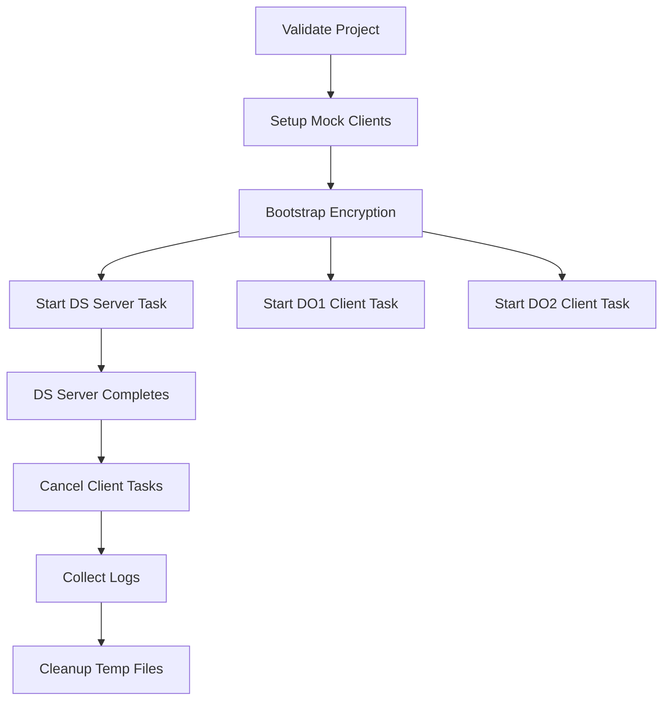

## Overview

The `run` function executes a bootstrapped Syft-Flwr project in simulation mode, allowing you to test your federated learning workflow locally using mock datasets before deploying to real datasites.

## Function Signature

```python
def run(
    project_dir: Union[str, Path],
    mock_dataset_paths: list[Union[str, Path]]
) -> Union[bool, asyncio.Task]
```

## Parameters

<ParamField path="project_dir" type="Union[str, Path]" required>
  Path to the bootstrapped Syft-Flwr project directory. Must contain `main.py` and `pyproject.toml`.
</ParamField>

<ParamField path="mock_dataset_paths" type="list[Union[str, Path]]" required>
  List of paths to mock datasets for each datasite. The number of paths must match the number of datasites configured during bootstrap.
</ParamField>

## Returns

<ResponseField name="Synchronous Mode" type="bool">
  Returns `True` if simulation succeeded, `False` otherwise. Used when running in scripts or standard Python environments.
</ResponseField>

<ResponseField name="Async Mode" type="asyncio.Task">
  Returns a task handle if running in an async environment (e.g., Jupyter). Callers can await this task.
</ResponseField>

## What It Does

1. **Validates the project** - Ensures the project was bootstrapped correctly
2. **Sets up mock RDS clients** - Creates simulated SyftBox network in a temporary directory
3. **Bootstraps encryption keys** - Generates E2E encryption keys for all participants (if enabled)
4. **Runs simulation** - Executes server and client code concurrently:
   - DS (Data Scientist) runs the server/aggregator code
   - Each DO (Data Owner) runs client code on their mock dataset
5. **Collects logs** - Saves execution logs to `{project_dir}/simulation_logs/`
6. **Cleans up** - Removes temporary network directory and encryption keys

## Usage Example

From `notebooks/fl-diabetes-prediction/local/ds.ipynb:323-326`:

```python
import syft_flwr
from pathlib import Path

SYFT_FLWR_PROJECT_PATH = Path("../fl-diabetes-prediction")

# Get mock dataset paths (from datasites)
mock_paths = []
for client in do_clients:
    dataset = client.dataset.get(name="pima-indians-diabetes-database")
    mock_paths.append(dataset.get_mock_path())

# Run simulation
print(f"Running syft_flwr simulation with mock paths: {mock_paths}")
syft_flwr.run(SYFT_FLWR_PROJECT_PATH, mock_paths)
```

## Simulation Logs

Logs for each participant are saved to:

```
{project_dir}/simulation_logs/
├── ds@openmined.org.log      # Aggregator logs
├── do1@openmined.org.log     # Data Owner 1 logs
└── do2@openmined.org.log     # Data Owner 2 logs
```

## Environment Variables

<ParamField path="SYFT_FLWR_ENCRYPTION_ENABLED" type="str" default="true">
  Set to `"false"` to disable end-to-end encryption during simulation.
</ParamField>

<ParamField path="SYFT_FLWR_SKIP_MODULE_CHECK" type="str" default="false">
  Set to `"true"` to skip module validation (useful for parallel testing).
</ParamField>

<ParamField path="DATA_DIR" type="str">
  Automatically set for each client to point to their mock dataset path.
</ParamField>

<ParamField path="SYFTBOX_CLIENT_CONFIG_PATH" type="str">
  Automatically set for each client to point to their simulated config.
</ParamField>

## Execution Flow



## Exceptions

<ResponseField name="FileNotFoundError">
  Raised if project directory, `main.py`, or `pyproject.toml` doesn't exist.
</ResponseField>

<ResponseField name="NotADirectoryError">
  Raised if the project path is not a directory.
</ResponseField>

<ResponseField name="ValueError">
  Raised if any mock dataset path doesn't exist.
</ResponseField>

## Notes

- Simulation runs in a temporary directory under `/tmp/{project_name}`
- The server task completes first, then client tasks are automatically cancelled
- All temporary files and encryption keys are cleaned up after simulation
- In Jupyter environments, the function returns a task that can be awaited
- DS logs are printed to stdout after the server completes