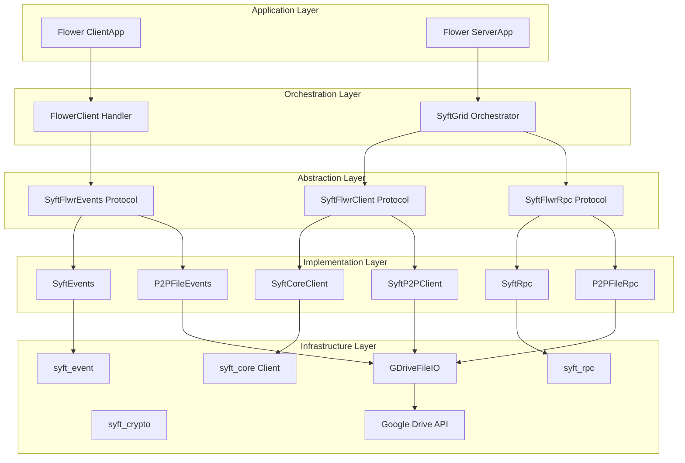

## Architectural Layers

Syft-Flwr is organized into five distinct layers, each with clear responsibilities:



## Layer 1: Application Layer

This is where your federated learning logic lives, using standard Flower APIs.

### Client Application

Defines local training behavior:

```python
# my_fl_project/my_app/client_app.py
from flwr.client import ClientApp, NumPyClient
from flwr.common import Context

class MyClient(NumPyClient):
    def fit(self, parameters, config):
        # Local training logic
        model.set_weights(parameters)
        model.fit(train_data)
        return model.get_weights(), len(train_data), {}
    
    def evaluate(self, parameters, config):
        # Local evaluation logic
        model.set_weights(parameters)
        loss, accuracy = model.evaluate(test_data)
        return loss, len(test_data), {"accuracy": accuracy}

def client_fn(context: Context):
    return MyClient().to_client()

app = ClientApp(client_fn=client_fn)
```

### Server Application

Defines aggregation strategy:

```python
# my_fl_project/my_app/server_app.py
from flwr.server import ServerApp, ServerConfig
from flwr.server.strategy import FedAvg
from flwr.common import Context

def server_fn(context: Context):
    strategy = FedAvg(
        fraction_fit=1.0,
        fraction_evaluate=1.0,
        min_fit_clients=2,
        min_evaluate_clients=2,
        min_available_clients=2,
    )
    config = ServerConfig(num_rounds=3)
    return ServerConfig(), strategy

app = ServerApp(server_fn=server_fn)
```

<Note>
These applications work identically whether running locally, with gRPC, or with Syft-Flwr's file-based transport.
</Note>

## Layer 2: Orchestration Layer

Bridges Flower applications with the transport layer.

### SyftGrid: Server-Side Orchestrator

Implements Flower's `Grid` protocol for message coordination:

```python
# src/syft_flwr/fl_orchestrator/syft_grid.py (simplified)
from flwr.server.grid import Grid

class SyftGrid(Grid):
    """Server-side message orchestrator for federated learning."""
    
    def __init__(self, app_name: str, datasites: list[str], client: SyftFlwrClient):
        self._client = client
        self._rpc = create_rpc(client=client, app_name=app_name)
        self.datasites = datasites
        self.client_map = {str_to_int(ds): ds for ds in datasites}
    
    def push_messages(self, messages: Iterable[Message]) -> Iterable[str]:
        """Send messages to clients, return future IDs."""
        message_ids = []
        for msg in messages:
            dest_datasite = self.client_map[msg.metadata.dst_node_id]
            msg_bytes = flower_message_to_bytes(msg)
            
            future_id = self._rpc.send(
                to_email=dest_datasite,
                app_name=self.app_name,
                endpoint="messages",
                body=msg_bytes,
                encrypt=self._encryption_enabled
            )
            message_ids.append(future_id)
        return message_ids
    
    def pull_messages(self, message_ids: List[str]) -> Tuple[Dict[str, Message], set]:
        """Poll for responses using future IDs."""
        messages = {}
        completed_ids = set()
        
        for msg_id in message_ids:
            response_body = self._rpc.get_response(msg_id)
            if response_body:
                message = bytes_to_flower_message(response_body)
                messages[msg_id] = message
                completed_ids.add(msg_id)
                self._rpc.delete_future(msg_id)
        
        return messages, completed_ids
```

**Key Responsibilities**:
- Maps node IDs to participant emails
- Serializes Flower messages to protobuf
- Manages encryption if enabled
- Tracks pending messages via future IDs
- Implements polling logic with configurable timeout

Location: `src/syft_flwr/fl_orchestrator/syft_grid.py:38`

### FlowerClient: Client-Side Handler

Processes incoming training requests:

```python
# src/syft_flwr/fl_orchestrator/flower_client.py (simplified)
class RequestProcessor:
    """Processes incoming requests and handles encryption/decryption."""
    
    def process(self, request_body: bytes) -> Optional[Union[str, bytes]]:
        # Decode if encrypted
        decoded_body = self.decode_request_body(request_body)
        
        # Deserialize Flower message
        message = bytes_to_flower_message(decoded_body)
        
        # Check for stop signal
        if self.is_stop_signal(message):
            self.events.stop()
            return None
        
        # Process with Flower ClientApp
        reply_message = self.client_app(message=message, context=self.context)
        
        # Serialize and encode response
        reply_bytes = flower_message_to_bytes(reply_message)
        return self.prepare_reply(reply_bytes)

def syftbox_flwr_client(client_app: ClientApp, context: Context, app_name: str):
    """Run the Flower ClientApp with SyftBox."""
    client = create_client()
    events_watcher = create_events_watcher(app_name=app_name, client=client)
    
    processor = RequestProcessor(...)
    
    # Register message handler
    events_watcher.on_request("/messages", handler=processor.process)
    
    # Block until stopped
    events_watcher.run_forever()
```

**Key Responsibilities**:
- Watches for incoming `.request` files
- Deserializes and validates messages
- Invokes Flower ClientApp
- Serializes responses to `.response` files
- Handles stop signals gracefully

Location: `src/syft_flwr/fl_orchestrator/flower_client.py:162`

## Layer 3: Abstraction Layer

Protocol definitions that enable the plugin system.

### SyftFlwrClient Protocol

Defines client identity and filesystem access:

```python
# src/syft_flwr/client/protocol.py
from abc import ABC, abstractmethod

class SyftFlwrClient(ABC):
    """Protocol for syft-flwr client implementations."""
    
    @property
    @abstractmethod
    def email(self) -> str:
        """Email of the current user."""
        ...
    
    @property
    @abstractmethod
    def my_datasite(self) -> Path:
        """Path to the user's datasite directory."""
        ...
    
    @abstractmethod
    def app_data(self, app_name: Optional[str] = None, datasite: Optional[str] = None) -> Path:
        """Get the app data directory path."""
        ...
    
    @abstractmethod
    def get_client(self) -> Any:
        """Get the underlying transport client."""
        ...
```

Location: `src/syft_flwr/client/protocol.py:6`

### SyftFlwrRpc Protocol

Defines request/response messaging:

```python
# src/syft_flwr/rpc/protocol.py
class SyftFlwrRpc(ABC):
    """Protocol for syft-flwr RPC implementations."""
    
    @abstractmethod
    def send(self, to_email: str, app_name: str, endpoint: str, 
             body: bytes, encrypt: bool = False) -> str:
        """Send a message, return future ID."""
        ...
    
    @abstractmethod
    def get_response(self, future_id: str) -> Optional[bytes]:
        """Poll for response by future ID."""
        ...
    
    @abstractmethod
    def delete_future(self, future_id: str) -> None:
        """Clean up after processing response."""
        ...
```

Location: `src/syft_flwr/rpc/protocol.py:5`

### SyftFlwrEvents Protocol

Defines event watching and handling:

```python
# src/syft_flwr/events/protocol.py
class SyftFlwrEvents(ABC):
    """Protocol for syft-flwr event handling implementations."""
    
    @abstractmethod
    def on_request(self, endpoint: str, handler: MessageHandler,
                   auto_decrypt: bool = True, encrypt_reply: bool = False) -> None:
        """Register a handler for incoming messages."""
        ...
    
    @abstractmethod
    def run_forever(self) -> None:
        """Start the event loop and block until stopped."""
        ...
    
    @abstractmethod
    def stop(self) -> None:
        """Signal the event loop to stop."""
        ...
```

Location: `src/syft_flwr/events/protocol.py:11`

## Layer 4: Implementation Layer

Concrete implementations for each transport type.

### SyftBox Transport Implementation

**SyftCoreClient**: Wraps `syft_core.Client`

```python
# src/syft_flwr/client/syft_core_client.py
class SyftCoreClient(SyftFlwrClient):
    def __init__(self, client: Client):
        self._client = client
    
    @property
    def email(self) -> str:
        return self._client.email
    
    def get_client(self) -> Client:
        return self._client  # Returns syft_core.Client for RPC/crypto
```

Location: `src/syft_flwr/client/syft_core_client.py:9`

**SyftRpc**: Uses syft_rpc with futures database

```python
# src/syft_flwr/rpc/syft_rpc.py
class SyftRpc(SyftFlwrRpc):
    def send(self, to_email: str, app_name: str, endpoint: str, 
             body: bytes, encrypt: bool = False) -> str:
        url = rpc.make_url(to_email, app_name=app_name, endpoint=endpoint)
        future = rpc.send(url=url, body=body, client=self._client, encrypt=encrypt)
        rpc_db.save_future(future=future, namespace=self._app_name, client=self._client)
        return future.id
```

Location: `src/syft_flwr/rpc/syft_rpc.py:12`

**SyftEvents**: File watching with `watchdog`

```python
# src/syft_flwr/events/syft_events.py
class SyftEvents(SyftFlwrEvents):
    def __init__(self, app_name: str, client: Client):
        self._events_watcher = SyftEventsWatcher(
            app_name=app_name,
            client=client,
        )
    
    def on_request(self, endpoint: str, handler: MessageHandler, 
                   auto_decrypt: bool = True, encrypt_reply: bool = False) -> None:
        @self._events_watcher.on_request(endpoint, auto_decrypt=auto_decrypt, 
                                         encrypt_reply=encrypt_reply)
        def wrapped_handler(request: Request) -> Optional[Union[str, bytes]]:
            return handler(request.body)
```

Location: `src/syft_flwr/events/syft_events.py:16`

### P2P Transport Implementation

**SyftP2PClient**: Direct Google Drive access

```python
# src/syft_flwr/client/syft_p2p_client.py
class SyftP2PClient(SyftFlwrClient):
    def __init__(self, email: str):
        self._email = email
    
    @property
    def my_datasite(self) -> Path:
        return Path("SyftBox") / self._email  # Logical path in Drive
    
    def get_client(self) -> "SyftP2PClient":
        return self  # Returns self - no separate RPC client
```

Location: `src/syft_flwr/client/syft_p2p_client.py:8`

**P2PFileRpc**: File-based RPC via Google Drive API

```python
# src/syft_flwr/rpc/p2p_file_rpc.py
class P2PFileRpc(SyftFlwrRpc):
    def __init__(self, sender_email: str, app_name: str):
        self._gdrive_io = GDriveFileIO(email=sender_email)
        self._pending_futures = {}  # In-memory tracking
    
    def send(self, to_email: str, app_name: str, endpoint: str, 
             body: bytes, encrypt: bool = False) -> str:
        future_id = str(uuid.uuid4())
        filename = f"{future_id}.request"
        
        self._gdrive_io.write_to_outbox(
            recipient_email=to_email,
            app_name=app_name,
            endpoint=endpoint,
            filename=filename,
            data=body
        )
        
        self._pending_futures[future_id] = (to_email, app_name, endpoint)
        return future_id
```

Location: `src/syft_flwr/rpc/p2p_file_rpc.py:12`

**P2PFileEvents**: Polling-based event detection

```python
# src/syft_flwr/events/p2p_fle_events.py
class P2PFileEvents(SyftFlwrEvents):
    def __init__(self, app_name: str, client_email: str, poll_interval: float = 2.0):
        self._gdrive_io = GDriveFileIO(email=client_email)
        self._handlers = {}  # endpoint -> handler
        self._poll_interval = poll_interval
    
    def _poll_loop(self) -> None:
        while not self._stop_event.is_set():
            sender_emails = self._gdrive_io.list_inbox_folders()
            for sender_email in sender_emails:
                for endpoint, (handler, _, _) in self._handlers.items():
                    request_files = self._gdrive_io.list_files_in_inbox_endpoint(
                        sender_email=sender_email,
                        app_name=self._app_name,
                        endpoint=endpoint,
                        suffix=".request"
                    )
                    for filename in request_files:
                        self._process_request(sender_email, endpoint, filename, handler)
            
            self._stop_event.wait(timeout=self._poll_interval)
```

Location: `src/syft_flwr/events/p2p_fle_events.py:18`

## Layer 5: Infrastructure Layer

External dependencies that provide core functionality.

### SyftBox Stack (Traditional Transport)

- **syft_core**: Client configuration and datasite management
- **syft_rpc**: URL-based messaging and futures database
- **syft_crypto**: X3DH key exchange and encryption
- **syft_event**: File system watching with `watchdog`

### Google Drive Stack (P2P Transport)

- **GDriveFileIO**: Wrapper around Google Drive API
- **GDriveConnection**: OAuth authentication and folder management
- **Google Drive API**: Underlying file storage and sync

Location: `src/syft_flwr/gdrive_io.py:29`

## Factory Pattern

The framework uses factory functions to create the appropriate implementations:

```python
# src/syft_flwr/client/factory.py
def create_client(transport: Optional[str] = None, 
                 project_dir: Optional[Path] = None,
                 email: Optional[str] = None) -> SyftFlwrClient:
    """Auto-detect and create the appropriate client."""
    
    # Load config from pyproject.toml if available
    if project_dir:
        config = load_flwr_pyproject(project_dir)
        transport = config.get("tool", {}).get("syft_flwr", {}).get("transport")
    
    # Create based on transport type
    if transport == "syftbox":
        return SyftCoreClient.load()
    elif transport == "p2p":
        return SyftP2PClient(email=email)
    elif _syft_core_available():
        return SyftCoreClient.load()  # Auto-detect local SyftBox
    else:
        raise RuntimeError("Could not determine transport type")
```

Location: `src/syft_flwr/client/factory.py:57`

## Configuration Management

Project configuration is stored in `pyproject.toml`:

```toml
[tool.syft_flwr]
app_name = "server@example.com_my_fl_app_1234567890"
aggregator = "server@example.com"
datasites = ["client1@example.com", "client2@example.com"]
transport = "syftbox"  # or "p2p"

[tool.flwr.app]
components.serverapp = "my_app.server_app:app"
components.clientapp = "my_app.client_app:app"
```

This is created by the `bootstrap()` function (see `src/syft_flwr/bootstrap.py:100`).

## Message Serialization

Flower messages are serialized using Protocol Buffers:

```python
# src/syft_flwr/serde.py
from flwr.common.serde import message_from_proto, message_to_proto
from flwr.proto.message_pb2 import Message as ProtoMessage

def flower_message_to_bytes(message: Message) -> bytes:
    msg_proto = message_to_proto(message)
    return msg_proto.SerializeToString()

def bytes_to_flower_message(data: bytes) -> Message:
    message_pb = ProtoMessage()
    message_pb.ParseFromString(data)
    return message_from_proto(message_pb)
```

Location: `src/syft_flwr/serde.py:6`

## Next Steps

<CardGroup cols={2}>
  <Card title="File-Based Communication" icon="folder-tree" href="/concepts/file-based-communication">
    Learn how messages flow through the file system
  </Card>
  <Card title="Transport Layers" icon="layer-group" href="/concepts/transport-layers">
    Compare implementation details
  </Card>
</CardGroup>