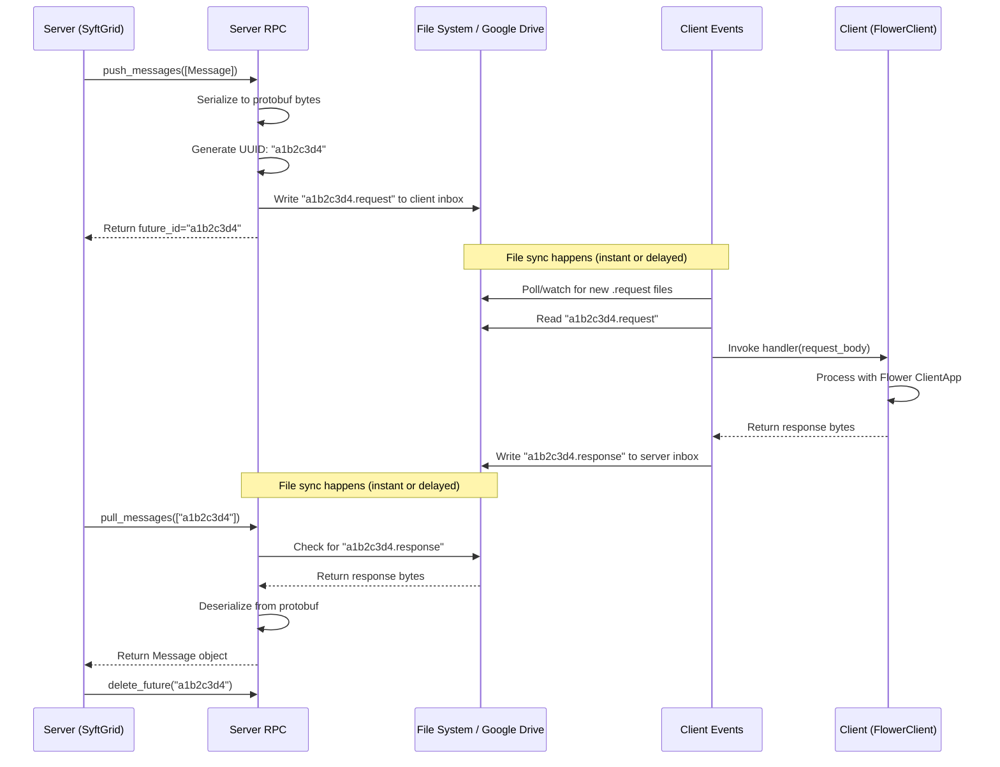

## Overview

Unlike traditional federated learning systems that require persistent network connections, Syft-Flwr uses **file-based messaging** where participants communicate by writing and reading files in shared directories. This enables:

- **Offline-first operation**: Participants don't need to be online simultaneously
- **Network resilience**: Communication survives network disruptions
- **Audit trails**: Every message is a file with timestamps
- **Simple debugging**: Inspect message contents directly

## Directory Structure

Syft-Flwr organizes messages in a hierarchical folder structure:

```
SyftBox/
├── syft_outbox_inbox_server@example.com_to_client1@example.com/
│   └── my_fl_app/
│       └── rpc/
│           └── messages/
│               ├── a1b2c3d4.request   # Server → Client1
│               └── a1b2c3d4.response  # Client1 → Server
│
├── syft_outbox_inbox_server@example.com_to_client2@example.com/
│   └── my_fl_app/
│       └── rpc/
│           └── messages/
│               ├── e5f6g7h8.request
│               └── e5f6g7h8.response
│
└── syft_outbox_inbox_client1@example.com_to_server@example.com/
    └── my_fl_app/
        └── rpc/
            └── messages/
                └── i9j0k1l2.response  # Client1's responses to Server
```

### Folder Naming Convention

**Pattern**: `syft_outbox_inbox_{sender}_to_{recipient}`

- **sender**: Email of the message sender
- **recipient**: Email of the message recipient

Each direction of communication gets its own folder:
- `server_to_client`: Server sends requests, client reads them
- `client_to_server`: Client sends responses, server reads them

### Path Components

```
{sender}_to_{recipient}/{app_name}/rpc/{endpoint}/{uuid}.{request|response}
```

- **app_name**: Unique identifier for the FL application (e.g., `server@example.com_my_fl_app_1234567890`)
- **endpoint**: RPC endpoint, typically `messages` for FL communication
- **uuid**: Unique message identifier
- **extension**: `.request` for outgoing messages, `.response` for replies

## Message Flow

### Server → Client Request



### Implementation: Server Side

```python
# Server sends a training request
class SyftGrid(Grid):
    def push_messages(self, messages: Iterable[Message]) -> Iterable[str]:
        """Send messages to clients."""
        message_ids = []
        
        for msg in messages:
            # Map node ID to email
            dest_email = self.client_map[msg.metadata.dst_node_id]
            
            # Serialize Flower message
            msg_bytes = flower_message_to_bytes(msg)
            
            # Send via RPC layer
            future_id = self._rpc.send(
                to_email=dest_email,
                app_name=self.app_name,
                endpoint="messages",
                body=msg_bytes,
                encrypt=self._encryption_enabled
            )
            
            message_ids.append(future_id)
        
        return message_ids
```

Location: `src/syft_flwr/fl_orchestrator/syft_grid.py:199`

### Implementation: RPC Layer (SyftBox)

```python
# SyftBox transport: Uses syft_rpc with futures database
class SyftRpc(SyftFlwrRpc):
    def send(self, to_email: str, app_name: str, endpoint: str, 
             body: bytes, encrypt: bool = False) -> str:
        # Create URL: syftbox://{to_email}/app_data/{app_name}/rpc/{endpoint}
        url = rpc.make_url(to_email, app_name=app_name, endpoint=endpoint)
        
        # Send message (writes to recipient's inbox)
        future = rpc.send(
            url=url,
            body=body,
            client=self._client,
            encrypt=encrypt
        )
        
        # Save future to database for tracking
        rpc_db.save_future(
            future=future,
            namespace=self._app_name,
            client=self._client
        )
        
        return future.id
```

Location: `src/syft_flwr/rpc/syft_rpc.py:26`

### Implementation: RPC Layer (P2P)

```python
# P2P transport: Uses Google Drive API directly
class P2PFileRpc(SyftFlwrRpc):
    def send(self, to_email: str, app_name: str, endpoint: str, 
             body: bytes, encrypt: bool = False) -> str:
        # Generate unique ID
        future_id = str(uuid.uuid4())
        filename = f"{future_id}.request"
        
        # Write to Google Drive outbox folder
        self._gdrive_io.write_to_outbox(
            recipient_email=to_email,
            app_name=app_name,
            endpoint=endpoint,
            filename=filename,
            data=body
        )
        
        # Track in-memory for polling
        self._pending_futures[future_id] = (to_email, app_name, endpoint)
        
        return future_id
```

Location: `src/syft_flwr/rpc/p2p_file_rpc.py:38`

### Implementation: Client Side

```python
# Client watches for incoming messages
class P2PFileEvents(SyftFlwrEvents):
    def _poll_loop(self) -> None:
        """Poll for new request files."""
        while not self._stop_event.is_set():
            # Find all senders with messages for us
            sender_emails = self._gdrive_io.list_inbox_folders()
            
            for sender_email in sender_emails:
                for endpoint, (handler, _, _) in self._handlers.items():
                    # List .request files
                    request_files = self._gdrive_io.list_files_in_inbox_endpoint(
                        sender_email=sender_email,
                        app_name=self._app_name,
                        endpoint=endpoint,
                        suffix=".request"
                    )
                    
                    # Process each request
                    for filename in request_files:
                        self._process_request(sender_email, endpoint, filename, handler)
            
            # Sleep before next poll
            self._stop_event.wait(timeout=self._poll_interval)
    
    def _process_request(self, sender_email: str, endpoint: str, 
                        filename: str, handler: MessageHandler) -> None:
        """Process a single request file."""
        # Read request
        request_body = self._gdrive_io.read_from_inbox(
            sender_email=sender_email,
            app_name=self._app_name,
            endpoint=endpoint,
            filename=filename
        )
        
        # Invoke handler (calls Flower ClientApp)
        response = handler(request_body)
        
        if response is not None:
            # Extract UUID from filename
            future_id = filename.rsplit(".", 1)[0]
            response_filename = f"{future_id}.response"
            
            # Write response to outbox (sender will read it)
            self._gdrive_io.write_to_outbox(
                recipient_email=sender_email,
                app_name=self._app_name,
                endpoint=endpoint,
                filename=response_filename,
                data=response
            )
        
        # Clean up request file
        self._gdrive_io.delete_file_from_inbox(
            sender_email=sender_email,
            app_name=self._app_name,
            endpoint=endpoint,
            filename=filename
        )
```

Location: `src/syft_flwr/events/p2p_fle_events.py:179`

## Response Polling

The server polls for responses using future IDs:

```python
class SyftGrid(Grid):
    def pull_messages(self, message_ids: List[str]) -> Tuple[Dict[str, Message], set]:
        """Poll for response messages."""
        messages = {}
        completed_ids = set()
        
        for msg_id in message_ids:
            # Try to get response
            response_body = self._rpc.get_response(msg_id)
            
            if response_body is None:
                continue  # Not ready yet
            
            # Deserialize
            message = bytes_to_flower_message(response_body)
            messages[msg_id] = message
            completed_ids.add(msg_id)
            
            # Clean up
            self._rpc.delete_future(msg_id)
        
        return messages, completed_ids
    
    def send_and_receive(self, messages: Iterable[Message], 
                        timeout: Optional[float] = None) -> Iterable[Message]:
        """Push messages and poll for responses."""
        # Send messages
        msg_ids = set(self.push_messages(messages))
        
        # Poll until all responses received or timeout
        end_time = time.time() + (timeout or 120.0)
        responses = {}
        pending_ids = msg_ids.copy()
        
        while pending_ids and time.time() < end_time:
            batch, completed = self.pull_messages(list(pending_ids))
            responses.update(batch)
            pending_ids.difference_update(completed)
            
            if pending_ids:
                time.sleep(3)  # Poll interval
        
        return responses.values()
```

Location: `src/syft_flwr/fl_orchestrator/syft_grid.py:229`

<Note>
The timeout and poll interval can be configured via environment variables:
- `SYFT_FLWR_MSG_TIMEOUT`: Maximum wait time for responses (default: 120s)
- `SYFT_FLWR_POLL_INTERVAL`: Sleep between polls (default: 3s)
</Note>

## File Synchronization

### SyftBox Transport

Files are synchronized by the SyftBox daemon:
- **Local files** in `~/.syftbox/datasites/`
- **Watchdog** detects new files instantly
- **No network delay** for local testing
- **Real deployment** uses SyftBox server sync

### P2P Transport

Files are synchronized via Google Drive API:
- **Direct API calls** to Drive storage
- **No local files** - everything in the cloud
- **Cross-device sync** automatic via Google
- **Network latency** depends on Drive API response time

## Message Lifecycle

```mermaid
stateDiagram-v2
    [*] --> Created: Server creates Message
    Created --> Serialized: Protobuf encoding
    Serialized --> Encrypted: Optional (SyftBox only)
    Encrypted --> WrittenToFS: Write .request file
    Serialized --> WrittenToFS: Skip encryption (P2P)
    
    WrittenToFS --> InTransit: File sync happens
    InTransit --> Detected: Client polls/watches
    
    Detected --> ReadFromFS: Client reads file
    ReadFromFS --> Decrypted: Optional decryption
    Decrypted --> Deserialized: Protobuf decoding
    ReadFromFS --> Deserialized: Skip decryption
    
    Deserialized --> Processed: ClientApp handles
    Processed --> ResponseCreated: Generate response
    
    ResponseCreated --> ResponseSerialized: Protobuf encoding
    ResponseSerialized --> ResponseEncrypted: Optional encryption
    ResponseEncrypted --> ResponseWritten: Write .response file
    ResponseSerialized --> ResponseWritten: Skip encryption
    
    ResponseWritten --> ResponseInTransit: File sync happens
    ResponseInTransit --> ResponseDetected: Server polls
    ResponseDetected --> ResponseRead: Server reads file
    
    ResponseRead --> ResponseDecrypted: Optional decryption
    ResponseDecrypted --> ResponseDeserialized: Protobuf decoding
    ResponseRead --> ResponseDeserialized: Skip decryption
    
    ResponseDeserialized --> Completed: Server processes
    Completed --> Deleted: delete_future()
    Deleted --> [*]
```



## Advantages of File-Based Communication

### 1. Offline Operation

Participants don't need simultaneous connectivity:

```python
# Server sends requests at 9:00 AM
grid.push_messages([train_message_1, train_message_2])

# Client 1 processes at 10:00 AM (1 hour later)
# Client 2 processes at 2:00 PM (5 hours later)
# Both work fine!

# Server polls whenever convenient
responses = grid.send_and_receive(messages, timeout=3600)  # 1 hour timeout
```

### 2. Fault Tolerance

Network disruptions don't lose messages:

```
1. Server writes request file
2. Network goes down for 30 minutes
3. File still exists when network recovers
4. Client processes when connection restored
```

### 3. Debugging

Inspect messages directly:

```bash
# View raw protobuf message
cat ~/.syftbox/datasites/client@example.com/app_data/my_fl_app/rpc/messages/a1b2c3d4.request | xxd

# Check file timestamps
ls -lh ~/.syftbox/datasites/*/app_data/my_fl_app/rpc/messages/

# Monitor in real-time
watch -n 1 'ls -lh ~/.syftbox/datasites/*/app_data/my_fl_app/rpc/messages/'
```

### 4. Audit Trail

Every message is logged:

```python
# List all messages sent to a client
import os
from pathlib import Path

inbox_path = Path.home() / ".syftbox" / "datasites" / "client@example.com" / \
             "app_data" / "my_fl_app" / "rpc" / "messages"

for file in sorted(inbox_path.glob("*.request")):
    stat = file.stat()
    print(f"{file.name}: {stat.st_size} bytes, created {stat.st_mtime}")
```

### 5. Testability

Simulate scenarios by manually creating files:

```python
# Test client behavior with a specific message
from syft_flwr.serde import flower_message_to_bytes

test_message = Message(...)
msg_bytes = flower_message_to_bytes(test_message)

test_file = inbox_path / "test_message.request"
test_file.write_bytes(msg_bytes)

# Client will automatically process it
```

## Limitations and Considerations

### Polling Overhead

P2P transport requires periodic polling:

```python
# Default: poll every 2 seconds
events = P2PFileEvents(
    app_name="my_fl_app",
    client_email="client@example.com",
    poll_interval=2.0  # Adjust based on needs
)
```

**Trade-offs**:
- Shorter interval = faster response, more API calls
- Longer interval = slower response, fewer API calls

### File System Limits

Large models may hit file size limits:

```python
# Typical file size for a small CNN
model_size = len(flower_message_to_bytes(train_message))
print(f"Message size: {model_size / 1024 / 1024:.2f} MB")

# Google Drive: 750 GB daily upload limit per user
# Local filesystem: Depends on quota
```

### Cleanup

Old messages should be cleaned up:

```python
# SyftBox: Automatic cleanup via syft_event
events = SyftEvents(
    app_name="my_fl_app",
    client=client,
    cleanup_expiry="1d",    # Delete messages older than 1 day
    cleanup_interval="1d"   # Run cleanup daily
)

# P2P: Manual cleanup recommended
# (Future versions will add automatic cleanup)
```

## Best Practices

### 1. Set Appropriate Timeouts

```python
# For fast local networks
grid.send_and_receive(messages, timeout=60)  # 1 minute

# For slow or intermittent connections
grid.send_and_receive(messages, timeout=3600)  # 1 hour

# For truly asynchronous scenarios
future_ids = grid.push_messages(messages)
# Do other work...
responses, _ = grid.pull_messages(future_ids)
```

### 2. Handle Missing Responses

```python
responses = grid.send_and_receive(messages, timeout=300)

if len(responses) < len(messages):
    logger.warning(f"Only {len(responses)}/{len(messages)} clients responded")
    # Strategy can handle missing clients (Flower's default behavior)
```

### 3. Monitor File System Usage

```python
import shutil

# Check available space
stats = shutil.disk_usage(client.my_datasite)
free_gb = stats.free / (1024**3)

if free_gb < 1.0:
    logger.warning(f"Low disk space: {free_gb:.2f} GB free")
```

## Next Steps

<CardGroup cols={2}>
  <Card title="Transport Layers" icon="layer-group" href="/concepts/transport-layers">
    Deep dive into SyftBox vs P2P implementations
  </Card>
  <Card title="Privacy Model" icon="shield" href="/concepts/privacy-model">
    Understand encryption and data flow
  </Card>
</CardGroup>