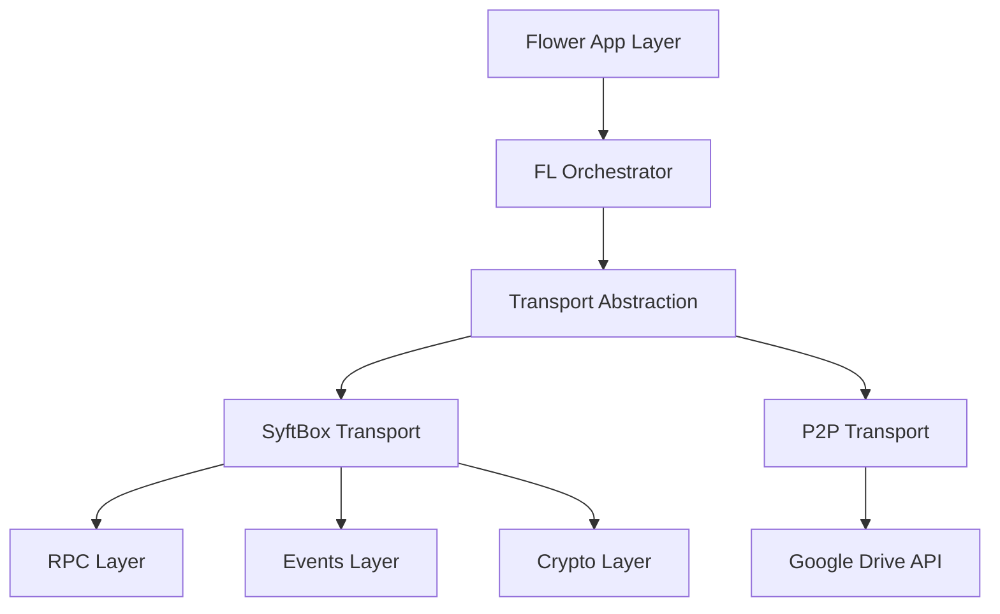

## What is Syft-Flwr?

Syft-Flwr is a privacy-preserving federated learning framework that bridges Flower (a production-ready FL framework) with SyftBox's file-based communication infrastructure. It enables researchers and organizations to conduct federated learning experiments with strong privacy guarantees, supporting both traditional SyftBox deployments and peer-to-peer scenarios.

## Design Philosophy

Syft-Flwr is built on three core principles:

### 1. File-Based Communication

Unlike traditional FL frameworks that require always-on network connections, Syft-Flwr uses **asynchronous file-based messaging**. This means:
- Participants don't need to be online simultaneously
- Training can continue across network disruptions
- Communication happens through filesystem synchronization (SyftBox or Google Drive)

### 2. Transport Abstraction

The framework abstracts the underlying transport layer, supporting:
- **SyftBox Transport**: Local file sync with RPC and optional encryption
- **P2P Transport**: Cloud-based sync via Google Drive for remote collaboration

Applications work identically regardless of transport choice.

### 3. Privacy by Design

Privacy guarantees are built into the architecture:
- Data never leaves participant devices
- Only model updates are shared
- Optional end-to-end encryption (via X3DH)
- File-based audit trails

## Key Components

Syft-Flwr consists of several architectural layers:



### Flower App Layer

Your federated learning logic using standard Flower APIs:
- `ClientApp`: Defines local training behavior
- `ServerApp`: Defines aggregation strategy
- No modifications needed to support file-based communication

### FL Orchestrator

Coordinates message flow between Flower and the transport layer:
- **SyftGrid**: Server-side message orchestrator implementing Flower's Grid protocol
- **FlowerClient**: Client-side message handler
- Manages serialization, encryption, and response tracking

### Transport Abstraction

Plugin system for different communication backends:
- **Client Protocol**: `SyftFlwrClient` defines datasite paths and email
- **RPC Protocol**: `SyftFlwrRpc` handles request/response messaging
- **Events Protocol**: `SyftFlwrEvents` monitors incoming messages

See [Transport Layers](/concepts/transport-layers) for details.

### Communication Backends

**SyftBox Transport** (traditional):
- Uses local SyftBox installation
- File watching via `watchdog`
- Optional X3DH encryption
- RPC futures database

**P2P Transport** (cloud-based):
- Uses Google Drive API directly
- No local SyftBox required
- Polling-based message detection
- No encryption (relies on Google's security)

## Architecture Highlights

### Plugin System

Syft-Flwr uses factory functions to create appropriate implementations:

```python
from syft_flwr.client import create_client
from syft_flwr.rpc import create_rpc
from syft_flwr.events import create_events_watcher

# Auto-detects transport from environment or config
client = create_client(project_dir="/path/to/project")
rpc = create_rpc(client=client, app_name="my_fl_app")
events = create_events_watcher(client=client, app_name="my_fl_app")
```

The factories inspect the client type and return the correct implementation (SyftBox or P2P).

### Message Flow

**Server → Client**:
1. Server creates Flower `Message` object
2. `SyftGrid` serializes to protobuf bytes
3. RPC layer writes `.request` file to client's inbox
4. Client's events layer detects new file
5. Client deserializes and processes message
6. Client writes `.response` file to server's inbox
7. Server polls and retrieves response

**File Structure**:
```
SyftBox/
└── syft_outbox_inbox_server@example.com_to_client@example.com/
    └── my_fl_app/
        └── rpc/
            └── messages/
                ├── uuid1.request   # Server → Client
                └── uuid1.response  # Client → Server
```

### Bootstrap Process

Initializing a Syft-Flwr project:

```python
from syft_flwr import bootstrap

bootstrap(
    flwr_project_dir="./my_fl_project",
    aggregator="server@example.com",
    datasites=["client1@example.com", "client2@example.com"],
    transport="syftbox"  # or "p2p" for Google Drive
)
```

This updates `pyproject.toml` with:
- Transport configuration
- Participant emails
- Unique app identifier
- syft_flwr as a dependency

## Extension Points

### Custom Transport Layers

Implement the protocol classes to add new backends:

```python
from syft_flwr.client.protocol import SyftFlwrClient
from syft_flwr.rpc.protocol import SyftFlwrRpc
from syft_flwr.events.protocol import SyftFlwrEvents

class MyCustomClient(SyftFlwrClient):
    # Implement email, paths, etc.
    ...

class MyCustomRpc(SyftFlwrRpc):
    # Implement send(), get_response(), delete_future()
    ...

class MyCustomEvents(SyftFlwrEvents):
    # Implement on_request(), run_forever(), stop()
    ...
```

### Custom Aggregation Strategies

Use any Flower strategy - Syft-Flwr is transport-agnostic:

```python
from flwr.server import ServerApp
from flwr.server.strategy import FedAvg, FedProx, QFedAvg

app = ServerApp(
    config=config,
    strategy=FedProx(...)  # Any Flower strategy works
)
```

## Next Steps

<CardGroup cols={2}>
  <Card title="Architecture Deep Dive" icon="diagram-project" href="/concepts/architecture">
    Explore the detailed component architecture
  </Card>
  <Card title="File-Based Communication" icon="folder-tree" href="/concepts/file-based-communication">
    Understand the messaging model
  </Card>
  <Card title="Transport Layers" icon="layer-group" href="/concepts/transport-layers">
    Compare SyftBox vs P2P transports
  </Card>
  <Card title="Privacy Model" icon="shield" href="/concepts/privacy-model">
    Learn about privacy guarantees
  </Card>
</CardGroup>