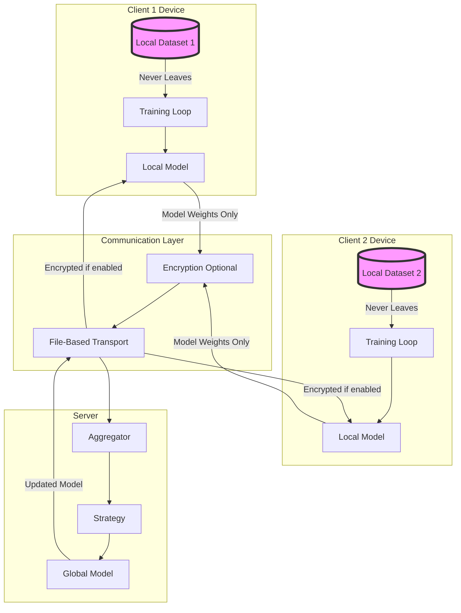
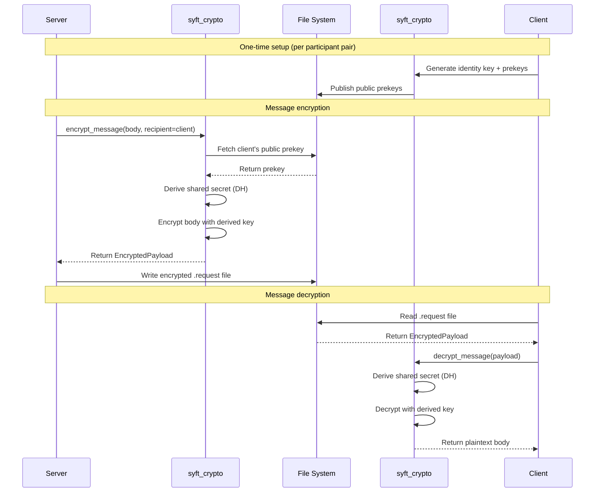

## Privacy Principles

Syft-Flwr is designed with privacy as a core principle:

1. **Data Minimization**: Only model updates leave participant devices
2. **Local Computation**: Training happens entirely on local data
3. **Optional Encryption**: End-to-end encryption for SyftBox transport
4. **Transparency**: File-based audit trails for all communications
5. **Participant Control**: Data owners control access and participation

## Data Flow Architecture



### What Leaves the Device

**Transmitted**:
- Model parameters (weights, biases)
- Training metrics (loss, accuracy)
- Dataset size (number of samples)
- Metadata (round number, client ID)

**Never Transmitted**:
- Raw training data
- Individual data points
- Feature values
- Labels or annotations
- Dataset structure details

### Example Data Flow

```python
# On Client Device
class MyClient(NumPyClient):
    def fit(self, parameters, config):
        # 1. Receive global model parameters
        model.set_weights(parameters)
        
        # 2. Train on LOCAL data (never transmitted)
        model.fit(
            x_train,  # STAYS ON DEVICE
            y_train,  # STAYS ON DEVICE
            epochs=5
        )
        
        # 3. Return ONLY model updates
        return (
            model.get_weights(),  # Transmitted: model parameters
            len(x_train),         # Transmitted: dataset size
            {"loss": 0.5}          # Transmitted: metrics
        )
```

Location: Example pattern from Flower documentation

## Encryption Model

### SyftBox Transport: X3DH Protocol

SyftBox transport supports optional **X3DH (Extended Triple Diffie-Hellman)** encryption:



### Enabling Encryption

**Bootstrap with encryption** (default):

```python
from syft_flwr import bootstrap

bootstrap(
    flwr_project_dir="./project",
    aggregator="server@example.com",
    datasites=["client@example.com"],
    transport="syftbox"
)

# Encryption enabled by default
# Keys auto-generated on first run
```

**Disable encryption** (development only):

```bash
export SYFT_FLWR_ENCRYPTION_ENABLED=false
python main.py
```

### Key Management

Keys are stored in datasites:

```
~/.syftbox/datasites/{email}/
├── public/
│   └── x3dh/
│       ├── identity_key.pub      # Public identity key
│       ├── signed_prekey.pub     # Public signed prekey
│       └── onetime_prekeys/      # Public one-time prekeys
│           ├── prekey_001.pub
│           └── prekey_002.pub
│
└── private/
    └── x3dh/
        ├── identity_key.priv     # Private identity key
        ├── signed_prekey.priv    # Private signed prekey
        └── onetime_prekeys/      # Private one-time prekeys
            ├── prekey_001.priv
            └── prekey_002.priv
```

**Key Bootstrap Process**:

```python
# src/syft_flwr/utils.py
from syft_crypto.x3dh_bootstrap import ensure_bootstrap

def setup_client(app_name: str, project_dir: Optional[Path] = None):
    client = create_client(project_dir=project_dir)
    
    encryption_enabled = os.environ.get("SYFT_FLWR_ENCRYPTION_ENABLED", "true").lower() != "false"
    
    if encryption_enabled and not isinstance(client, SyftP2PClient):
        # Generate keys if they don't exist
        client = ensure_bootstrap(client)
        logger.info("🔐 End-to-end encryption is ENABLED")
    
    return client, encryption_enabled, f"flwr/{app_name}"
```

Location: `src/syft_flwr/utils.py:67`

### Encryption in Practice

**Server encrypts request**:

```python
# src/syft_flwr/fl_orchestrator/syft_grid.py
def _send_encrypted_message(self, msg_bytes: bytes, dest_datasite: str, msg: Message):
    # Base64 encode for encrypted transmission
    encoded_body = base64.b64encode(msg_bytes).decode("utf-8")
    
    # Send with encrypt=True
    future_id = self._rpc.send(
        to_email=dest_datasite,
        app_name=self.app_name,
        endpoint="messages",
        body=encoded_body.encode("utf-8"),
        encrypt=True  # Triggers X3DH encryption
    )
    
    logger.debug(f"🔐 Pushed ENCRYPTED message to {dest_datasite}")
    return future_id
```

Location: `src/syft_flwr/fl_orchestrator/syft_grid.py:396`

**Client decrypts request**:

```python
# src/syft_flwr/fl_orchestrator/flower_client.py
class RequestProcessor:
    def decode_request_body(self, request_body: Union[bytes, str]) -> bytes:
        if not self.message_handler.encryption_enabled:
            return request_body
        
        # Decode base64
        if isinstance(request_body, bytes):
            request_body_str = request_body.decode("utf-8")
        else:
            request_body_str = request_body
        
        decoded = base64.b64decode(request_body_str)
        logger.debug("🔓 Decoded base64 message")
        return decoded
```

Location: `src/syft_flwr/fl_orchestrator/flower_client.py:74`

<Note>
**Auto-decrypt**: The `syft_event` library automatically handles X3DH decryption when `auto_decrypt=True` is passed to `on_request()`.
</Note>

### P2P Transport Security

P2P transport does **not** use X3DH encryption:

```python
# src/syft_flwr/rpc/p2p_file_rpc.py
def send(self, to_email: str, app_name: str, endpoint: str, 
         body: bytes, encrypt: bool = False) -> str:
    if encrypt:
        logger.warning(
            "Encryption not supported in P2PFileRpc, sending unencrypted"
        )
    
    # Write plaintext to Google Drive
    # Relies on Google's transport security (HTTPS)
    self._gdrive_io.write_to_outbox(...)
```

Location: `src/syft_flwr/rpc/p2p_file_rpc.py:38`

**P2P Security Model**:
- **Transport encryption**: HTTPS between client and Google servers
- **Access control**: Google Drive file permissions
- **At-rest encryption**: Google's server-side encryption
- **No end-to-end encryption**: Google can theoretically access plaintext

## Privacy Guarantees

### What Syft-Flwr Protects

| Threat | SyftBox (Encrypted) | SyftBox (Unencrypted) | P2P |
|--------|---------------------|----------------------|-----|
| **Network eavesdropping** | ✅ X3DH encryption | ❌ Plaintext | ✅ HTTPS |
| **File system snooping** | ✅ Encrypted files | ❌ Plaintext files | N/A (cloud) |
| **Man-in-the-middle** | ✅ X3DH authentication | ❌ No authentication | ✅ TLS |
| **Server compromise** | ✅ Can't read client data | ❌ Can read messages | ⚠️ Google has keys |
| **Client impersonation** | ✅ X3DH identity keys | ❌ No verification | ⚠️ OAuth-based |
| **Data leakage** | ✅ Only model updates | ✅ Only model updates | ✅ Only model updates |

### What Syft-Flwr Does NOT Protect

**Model inversion attacks**: Adversary reconstructs training data from model updates

```python
# Syft-Flwr transmits model weights
weights = model.get_weights()

# Sophisticated adversary might infer training data characteristics
# Mitigation: Use differential privacy (not built into Syft-Flwr)
```

**Membership inference**: Adversary determines if a specific sample was in training set

**Gradient leakage**: Gradients can leak information about training data

<Warning>
For scenarios requiring **differential privacy**, combine Syft-Flwr with libraries like [Opacus](https://opacus.ai/) or use Flower's built-in DP support.
</Warning>

## Audit and Transparency

### Message Audit Trail

Every message is a file with metadata:

```bash
# List all messages sent to a client
ls -lh ~/.syftbox/datasites/client@example.com/app_data/my_fl_app/rpc/messages/

# Output:
# -rw-r--r-- 1 user user 2.3M Mar 02 10:15 a1b2c3d4.request
# -rw-r--r-- 1 user user 2.4M Mar 02 10:16 a1b2c3d4.response
# -rw-r--r-- 1 user user 2.3M Mar 02 11:20 e5f6g7h8.request
# -rw-r--r-- 1 user user 2.4M Mar 02 11:21 e5f6g7h8.response
```

### Inspecting Messages

**Unencrypted messages** (protobuf):

```python
from pathlib import Path
from syft_flwr.serde import bytes_to_flower_message

# Read message file
msg_path = Path("~/.syftbox/datasites/client@example.com/app_data/my_fl_app/rpc/messages/a1b2c3d4.request").expanduser()
msg_bytes = msg_path.read_bytes()

# Deserialize
message = bytes_to_flower_message(msg_bytes)

print(f"Message type: {message.metadata.message_type}")
print(f"From node: {message.metadata.src_node_id}")
print(f"To node: {message.metadata.dst_node_id}")
print(f"Round: {message.metadata.group_id}")
```

**Encrypted messages**:

```python
from syft_crypto import EncryptedPayload, decrypt_message
from syft_core import Client

# Read encrypted message
msg_bytes = msg_path.read_bytes()

# Parse as encrypted payload
encrypted = EncryptedPayload.model_validate_json(msg_bytes.decode())

print(f"Encrypted by: {encrypted.sender}")
print(f"Encrypted for: {encrypted.recipient}")
print(f"Key exchange: X3DH")

# Decrypt (requires recipient's private key)
client = Client.load()
plaintext = decrypt_message(encrypted, client=client)
message = bytes_to_flower_message(plaintext)
```

### Logging

Syft-Flwr logs all privacy-relevant operations:

```python
# Encryption status is always logged
logger.info("🔐 End-to-end encryption is ENABLED for FL messages")
logger.warning("⚠️ End-to-end encryption is DISABLED for FL messages")

# Message transmission is logged
logger.debug("🔐 Pushed ENCRYPTED message to client@example.com, size 2.3 MB")
logger.debug("📤 Pushed PLAINTEXT message to client@example.com, size 2.3 MB")

# Decryption is logged
logger.debug("🔓 Successfully decrypted message")
logger.debug("📥 Received PLAINTEXT message")
```

## Privacy Best Practices

### 1. Use Encryption in Production

```python
# Development: encryption optional
export SYFT_FLWR_ENCRYPTION_ENABLED=false

# Production: encryption required
unset SYFT_FLWR_ENCRYPTION_ENABLED  # Defaults to true
```

### 2. Rotate Keys Periodically

```bash
# Backup old keys
mv ~/.syftbox/datasites/me@example.com/private/x3dh ~/.syftbox/datasites/me@example.com/private/x3dh.backup

# Generate new keys on next run
python main.py  # Auto-generates new keys
```

### 3. Minimize Data Exposure

```python
class PrivacyAwareClient(NumPyClient):
    def fit(self, parameters, config):
        model.set_weights(parameters)
        model.fit(x_train, y_train, epochs=5)
        
        # Only return aggregated metrics
        return (
            model.get_weights(),
            len(x_train),  # OK: dataset size
            {"loss": avg_loss}  # OK: aggregated metric
            # DON'T return: per-sample losses, gradients, embeddings
        )
```

### 4. Validate Participants

```python
# Only allow known participants
bootstrap(
    flwr_project_dir="./project",
    aggregator="trusted-server@example.com",
    datasites=[
        "verified-client1@example.com",
        "verified-client2@example.com"
    ],
    transport="syftbox"
)
```

### 5. Monitor for Anomalies

```python
# Server-side validation
class SecureStrategy(FedAvg):
    def aggregate_fit(self, server_round, results, failures):
        # Check for suspiciously large updates
        for client_proxy, fit_res in results:
            weights = parameters_to_ndarrays(fit_res.parameters)
            total_size = sum(w.nbytes for w in weights)
            
            if total_size > 100_000_000:  # 100 MB
                logger.warning(f"Client {client_proxy.cid} sent large update: {total_size/1e6:.1f} MB")
        
        return super().aggregate_fit(server_round, results, failures)
```

### 6. Use Differential Privacy

Combine with Opacus for formal privacy guarantees:

```python
from opacus import PrivacyEngine

class DPClient(NumPyClient):
    def fit(self, parameters, config):
        model.set_weights(parameters)
        
        # Attach privacy engine
        privacy_engine = PrivacyEngine()
        model, optimizer, train_loader = privacy_engine.make_private(
            module=model,
            optimizer=optimizer,
            data_loader=train_loader,
            noise_multiplier=1.1,
            max_grad_norm=1.0,
        )
        
        # Train with DP guarantees
        model.fit(train_loader, epochs=5)
        
        epsilon = privacy_engine.get_epsilon(delta=1e-5)
        logger.info(f"Privacy budget: ε={epsilon:.2f}")
        
        return model.get_weights(), len(train_loader.dataset), {"epsilon": epsilon}
```

## Compliance Considerations

### GDPR Compliance

Syft-Flwr supports GDPR requirements:

- **Data minimization**: Only model updates transmitted (Art. 5)
- **Purpose limitation**: FL-specific communication (Art. 5)
- **Transparency**: File-based audit logs (Art. 15)
- **Right to erasure**: Delete local data anytime (Art. 17)
- **Data portability**: Standard Flower format (Art. 20)

### HIPAA Compliance

For healthcare data:

- ✅ Use **SyftBox with encryption** (satisfies encryption requirements)
- ✅ Implement **access controls** (validate participant emails)
- ✅ Maintain **audit logs** (file timestamps and metadata)
- ⚠️ P2P transport may not meet requirements (data passes through Google)

## Security Checklist

- [ ] Enable encryption for production deployments
- [ ] Use strong participant authentication (email verification)
- [ ] Implement anomaly detection in aggregation strategy
- [ ] Regularly audit message logs
- [ ] Rotate encryption keys periodically
- [ ] Use differential privacy for sensitive data
- [ ] Validate model updates before aggregation
- [ ] Monitor disk usage and clean up old messages
- [ ] Document data flow for compliance
- [ ] Test privacy guarantees with adversarial scenarios

## Next Steps

<CardGroup cols={2}>
  <Card title="Architecture" icon="diagram-project" href="/concepts/architecture">
    Understand the technical implementation
  </Card>
  <Card title="File-Based Communication" icon="folder-tree" href="/concepts/file-based-communication">
    Learn how messages flow securely
  </Card>
</CardGroup>