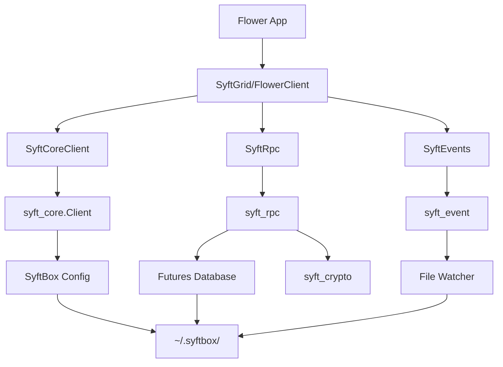
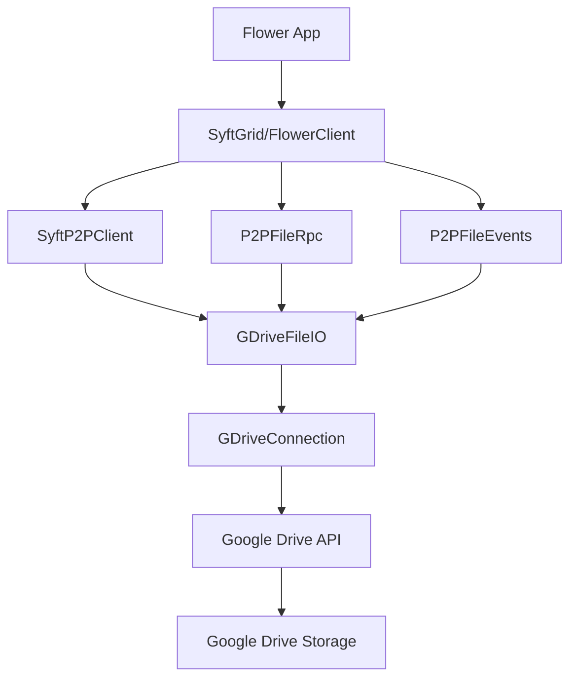

## Transport Layer Overview

Syft-Flwr supports two distinct transport mechanisms, each optimized for different use cases:

| Feature | SyftBox Transport | P2P Transport |
|---------|-------------------|---------------|
| **Backend** | Local SyftBox daemon + file sync | Google Drive API |
| **Encryption** | Optional X3DH end-to-end | Google's transport security |
| **Detection** | File watching (instant) | Polling (2s default) |
| **Requires** | SyftBox installation | Google account + OAuth |
| **Best For** | Local testing, private infrastructure | Remote collaboration, Colab |
| **Offline** | Full offline support | Requires internet |

## Protocol-Based Design

Both transports implement the same three protocols, ensuring applications work identically:

```python
from syft_flwr.client.protocol import SyftFlwrClient
from syft_flwr.rpc.protocol import SyftFlwrRpc
from syft_flwr.events.protocol import SyftFlwrEvents

# Application code is transport-agnostic
def run_fl_training(client: SyftFlwrClient, app_name: str):
    rpc = create_rpc(client, app_name)
    events = create_events_watcher(client, app_name)
    
    # Same code works for both SyftBox and P2P!
    events.on_request("/messages", handler=process_message)
    events.run_forever()
```

Location: Protocol definitions in `src/syft_flwr/client/protocol.py`, `src/syft_flwr/rpc/protocol.py`, `src/syft_flwr/events/protocol.py`

## SyftBox Transport

### Architecture



### Components

#### SyftCoreClient

Wraps `syft_core.Client` to provide datasite access:

```python
# src/syft_flwr/client/syft_core_client.py
from syft_core import Client

class SyftCoreClient(SyftFlwrClient):
    def __init__(self, client: Client):
        self._client = client
    
    @property
    def email(self) -> str:
        return self._client.email
    
    @property
    def my_datasite(self) -> Path:
        # Returns ~/.syftbox/datasites/{email}/
        return self._client.my_datasite
    
    def app_data(self, app_name: Optional[str] = None, 
                datasite: Optional[str] = None) -> Path:
        # Returns ~/.syftbox/datasites/{datasite}/app_data/{app_name}/
        return self._client.app_data(app_name, datasite)
    
    def get_client(self) -> Client:
        # Returns underlying syft_core.Client for RPC/crypto operations
        return self._client
```

Location: `src/syft_flwr/client/syft_core_client.py:9`

#### SyftRpc

Uses `syft_rpc` for URL-based messaging with futures:

```python
# src/syft_flwr/rpc/syft_rpc.py
from syft_rpc import rpc, rpc_db

class SyftRpc(SyftFlwrRpc):
    def send(self, to_email: str, app_name: str, endpoint: str, 
             body: bytes, encrypt: bool = False) -> str:
        # Create URL: syftbox://{to_email}/app_data/{app_name}/rpc/{endpoint}
        url = rpc.make_url(to_email, app_name=app_name, endpoint=endpoint)
        
        # Send message (writes to recipient's inbox)
        future = rpc.send(
            url=url,
            body=body,
            client=self._client,
            encrypt=encrypt  # Uses X3DH if True
        )
        
        # Save to futures database
        rpc_db.save_future(
            future=future,
            namespace=self._app_name,
            client=self._client
        )
        
        return future.id
    
    def get_response(self, future_id: str) -> Optional[bytes]:
        # Load future from database
        future = rpc_db.get_future(future_id=future_id, client=self._client)
        if future is None:
            return None
        
        # Check if response is ready
        response = future.resolve()
        if response is not None:
            response.raise_for_status()
            return response.body
        return None
    
    def delete_future(self, future_id: str) -> None:
        # Clean up from database
        rpc_db.delete_future(future_id=future_id, client=self._client)
```

Location: `src/syft_flwr/rpc/syft_rpc.py:12`

**Futures Database**: Tracks pending requests in `~/.syftbox/datasites/{email}/app_data/{app_name}/futures/`

#### SyftEvents

Uses `syft_event` for file watching:

```python
# src/syft_flwr/events/syft_events.py
from syft_event import SyftEvents as SyftEventsWatcher

class SyftEvents(SyftFlwrEvents):
    def __init__(self, app_name: str, client: Client):
        self._events_watcher = SyftEventsWatcher(
            app_name=app_name,
            client=client,
            cleanup_expiry="1d",    # Auto-delete old messages
            cleanup_interval="1d"
        )
    
    def on_request(self, endpoint: str, handler: MessageHandler,
                   auto_decrypt: bool = True, encrypt_reply: bool = False) -> None:
        # Register handler using decorator pattern
        @self._events_watcher.on_request(
            endpoint,
            auto_decrypt=auto_decrypt,
            encrypt_reply=encrypt_reply
        )
        def wrapped_handler(request: Request) -> Optional[Union[str, bytes]]:
            return handler(request.body)
    
    def run_forever(self) -> None:
        # Start file watcher (uses watchdog library)
        self._events_watcher.run_forever()
```

Location: `src/syft_flwr/events/syft_events.py:16`

**File Watching**: Uses `watchdog` library to detect new `.request` files instantly

### Encryption with X3DH

SyftBox transport supports optional end-to-end encryption:

```python
# Bootstrap with encryption enabled (default)
from syft_flwr import bootstrap

bootstrap(
    flwr_project_dir="./project",
    aggregator="server@example.com",
    datasites=["client@example.com"],
    transport="syftbox"
)

# Encryption is enabled by default
# Disable with: export SYFT_FLWR_ENCRYPTION_ENABLED=false
```

**X3DH Protocol**:
1. Each participant generates identity and prekeys
2. Sender retrieves recipient's public prekey
3. Sender derives shared secret via Diffie-Hellman
4. Message encrypted with derived key
5. Recipient decrypts using their private key

See [Privacy Model](/concepts/privacy-model) for details.

### File Structure

```
~/.syftbox/
├── config.json                          # SyftBox configuration
├── datasites/
│   ├── server@example.com/
│   │   ├── app_data/
│   │   │   └── my_fl_app/
│   │   │       ├── futures/             # RPC futures database
│   │   │       │   └── a1b2c3d4.json
│   │   │       └── rpc/
│   │   │           └── messages/
│   │   │               └── e5f6g7h8.response  # Responses from clients
│   │   └── public/
│   │       └── x3dh/                    # Public encryption keys
│   │
│   └── client@example.com/
│       ├── app_data/
│       │   └── my_fl_app/
│       │       ├── futures/
│       │       └── rpc/
│       │           └── messages/
│       │               ├── a1b2c3d4.request   # Requests from server
│       │               └── a1b2c3d4.response  # Responses to server
│       └── private/
│           └── x3dh/                    # Private encryption keys
```

### Advantages

- **Instant detection**: File watching triggers immediately
- **Offline support**: Works without internet
- **Privacy**: Optional end-to-end encryption
- **Local testing**: No external dependencies
- **Audit trail**: All files on local disk

### Limitations

- **Requires SyftBox**: Must install and run SyftBox daemon
- **Single machine**: Participants must share filesystem (or use SyftBox sync)
- **Setup complexity**: More configuration than P2P

## P2P Transport

### Architecture



### Components

#### SyftP2PClient

Lightweight client without local dependencies:

```python
# src/syft_flwr/client/syft_p2p_client.py
class SyftP2PClient(SyftFlwrClient):
    def __init__(self, email: str):
        self._email = email
    
    @property
    def email(self) -> str:
        return self._email
    
    @property
    def my_datasite(self) -> Path:
        # Logical path in Google Drive
        return Path("SyftBox") / self._email
    
    def app_data(self, app_name: Optional[str] = None,
                datasite: Optional[str] = None) -> Path:
        # Logical path: SyftBox/{datasite}/app_data/{app_name}/
        datasite = datasite or self._email
        if app_name:
            return Path("SyftBox") / datasite / "app_data" / app_name
        return Path("SyftBox") / datasite / "app_data"
    
    def get_client(self) -> "SyftP2PClient":
        # Return self - no separate RPC client needed
        return self
```

Location: `src/syft_flwr/client/syft_p2p_client.py:8`

<Note>
Paths are **logical** - they represent Drive folder structure, not local files.
</Note>

#### P2PFileRpc

Direct file operations via Google Drive API:

```python
# src/syft_flwr/rpc/p2p_file_rpc.py
from syft_flwr.gdrive_io import GDriveFileIO

class P2PFileRpc(SyftFlwrRpc):
    def __init__(self, sender_email: str, app_name: str):
        self._gdrive_io = GDriveFileIO(email=sender_email)
        self._pending_futures = {}  # In-memory tracking
    
    def send(self, to_email: str, app_name: str, endpoint: str,
             body: bytes, encrypt: bool = False) -> str:
        if encrypt:
            logger.warning("Encryption not supported in P2P, sending unencrypted")
        
        future_id = str(uuid.uuid4())
        filename = f"{future_id}.request"
        
        # Write directly to Google Drive
        self._gdrive_io.write_to_outbox(
            recipient_email=to_email,
            app_name=app_name,
            endpoint=endpoint.lstrip("/"),
            filename=filename,
            data=body
        )
        
        # Track for polling
        self._pending_futures[future_id] = (to_email, app_name, endpoint.lstrip("/"))
        return future_id
    
    def get_response(self, future_id: str) -> Optional[bytes]:
        future_data = self._pending_futures.get(future_id)
        if not future_data:
            return None
        
        recipient, app_name, endpoint = future_data
        filename = f"{future_id}.response"
        
        # Poll Google Drive for response
        return self._gdrive_io.read_from_inbox(
            sender_email=recipient,
            app_name=app_name,
            endpoint=endpoint,
            filename=filename
        )
    
    def delete_future(self, future_id: str) -> None:
        # Only clear in-memory tracking
        # Response files owned by client, can't delete
        self._pending_futures.pop(future_id, None)
```

Location: `src/syft_flwr/rpc/p2p_file_rpc.py:12`

#### P2PFileEvents

Polling-based message detection:

```python
# src/syft_flwr/events/p2p_fle_events.py
class P2PFileEvents(SyftFlwrEvents):
    def __init__(self, app_name: str, client_email: str, poll_interval: float = 2.0):
        self._gdrive_io = GDriveFileIO(email=client_email)
        self._poll_interval = poll_interval
        self._handlers = {}  # endpoint -> handler
        self._processed_requests = OrderedDict()  # LRU cache to avoid reprocessing
    
    def _poll_loop(self) -> None:
        """Main polling loop."""
        while not self._stop_event.is_set():
            # List all inbox folders (senders who have written to us)
            sender_emails = self._gdrive_io.list_inbox_folders()
            
            for sender_email in sender_emails:
                for endpoint, (handler, _, _) in self._handlers.items():
                    # List .request files
                    request_files = self._gdrive_io.list_files_in_inbox_endpoint(
                        sender_email=sender_email,
                        app_name=self._app_name,
                        endpoint=endpoint,
                        suffix=".request"
                    )
                    
                    # Process each request
                    for filename in request_files:
                        self._process_request(sender_email, endpoint, filename, handler)
            
            # Sleep before next poll
            self._stop_event.wait(timeout=self._poll_interval)
    
    def _process_request(self, sender_email: str, endpoint: str,
                        filename: str, handler: MessageHandler) -> None:
        # Skip if already processed (using LRU cache)
        request_key = f"{sender_email}:{endpoint}:{filename}"
        if request_key in self._processed_requests:
            return
        
        # Read request from Drive
        request_body = self._gdrive_io.read_from_inbox(
            sender_email=sender_email,
            app_name=self._app_name,
            endpoint=endpoint,
            filename=filename
        )
        
        # Process with handler
        response = handler(request_body)
        
        if response is not None:
            # Write response to Drive
            future_id = filename.rsplit(".", 1)[0]
            response_filename = f"{future_id}.response"
            
            self._gdrive_io.write_to_outbox(
                recipient_email=sender_email,
                app_name=self._app_name,
                endpoint=endpoint,
                filename=response_filename,
                data=response
            )
        
        # Delete request and mark as processed
        self._gdrive_io.delete_file_from_inbox(
            sender_email=sender_email,
            app_name=self._app_name,
            endpoint=endpoint,
            filename=filename
        )
        self._mark_as_processed(request_key)
```

Location: `src/syft_flwr/events/p2p_fle_events.py:18`

### Google Drive Integration

The `GDriveFileIO` class provides a clean interface:

```python
# src/syft_flwr/gdrive_io.py
from syft_client.sync.connections.drive.gdrive_transport import GDriveConnection

class GDriveFileIO:
    """File I/O wrapper around Google Drive API."""
    
    def __init__(self, email: str):
        self._email = email
        self._connection = None  # Lazily initialized
    
    def write_to_outbox(self, recipient_email: str, app_name: str,
                       endpoint: str, filename: str, data: bytes) -> None:
        """Write file to outbox folder in Google Drive."""
        conn = self._ensure_connection()
        
        # Get/create outbox folder
        outbox_folder = f"syft_outbox_inbox_{self._email}_to_{recipient_email}"
        outbox_folder_id = self._get_or_create_folder(
            outbox_folder,
            share_with_email=recipient_email  # Share for cross-account visibility
        )
        
        # Navigate to endpoint folder
        path_parts = [app_name, "rpc", endpoint]
        endpoint_folder_id = self._get_nested_folder(outbox_folder_id, path_parts)
        
        # Upload file
        payload, _ = conn.create_file_payload(data)
        file_metadata = {"name": filename, "parents": [endpoint_folder_id]}
        conn.drive_service.files().create(
            body=file_metadata,
            media_body=payload,
            fields="id"
        ).execute()
```

Location: `src/syft_flwr/gdrive_io.py:29`

### Google Drive Structure

```
Google Drive/
└── SyftBox/
    ├── syft_outbox_inbox_server@example.com_to_client@example.com/
    │   └── my_fl_app/
    │       └── rpc/
    │           └── messages/
    │               ├── a1b2c3d4.request
    │               └── a1b2c3d4.response
    │
    └── syft_outbox_inbox_client@example.com_to_server@example.com/
        └── my_fl_app/
            └── rpc/
                └── messages/
                    └── e5f6g7h8.response
```

### Authentication

**Google Colab**: Automatic OAuth flow

```python
from syft_flwr.client import create_client

# In Colab, this triggers OAuth popup
client = create_client(
    transport="p2p",
    email="client@example.com"
)
```

**Local Environment**: Token file

```bash
# Set token path
export GDRIVE_TOKEN_PATH=~/.gdrive_token.json

# Client uses token file automatically
python -m syft_flwr run ./project
```

### Advantages

- **No installation**: Works without SyftBox
- **Remote collaboration**: Participants can be anywhere
- **Colab support**: Easy to use in notebooks
- **Automatic sync**: Google handles file synchronization
- **Cross-platform**: Works on any OS with internet

### Limitations

- **No encryption**: Relies on Google's security (no X3DH)
- **Polling latency**: Default 2s delay to detect messages
- **API limits**: Google Drive has quota limits
- **Network required**: Can't work offline
- **Privacy concerns**: Data passes through Google servers (encrypted in transit)

## Choosing a Transport

### Use SyftBox Transport When:

- You need end-to-end encryption
- Participants are on the same network/infrastructure
- You want instant message detection
- You require full offline support
- You're running in a private datacenter
- You need complete control over data storage

### Use P2P Transport When:

- Participants are geographically distributed
- You're running in Google Colab
- You don't want to install SyftBox
- You can tolerate 2-second polling delays
- Google's security model is acceptable
- You want easy setup for experiments

## Auto-Detection

Syft-Flwr can auto-detect the appropriate transport:

```python
from syft_flwr.bootstrap import bootstrap

# Auto-detect (uses "p2p" in Colab, "syftbox" otherwise)
bootstrap(
    flwr_project_dir="./project",
    aggregator="server@example.com",
    datasites=["client@example.com"],
    transport=None  # Auto-detect
)

# Explicit override
bootstrap(
    ...,
    transport="p2p"  # Force P2P mode
)
```

Location: `src/syft_flwr/bootstrap.py:100`

## Performance Comparison

| Metric | SyftBox | P2P |
|--------|---------|-----|
| **Message Detection** | Less than 100ms (file watch) | ~2s (poll interval) |
| **Round-trip Latency** | ~200ms (local) | ~5s (Drive API + poll) |
| **Throughput** | Limited by disk I/O | Limited by Drive API quota |
| **Cold Start** | Instant (local files) | ~1s (OAuth + API init) |
| **Scalability** | Limited by filesystem | Excellent (Google's infra) |

## Next Steps

<CardGroup cols={2}>
  <Card title="Privacy Model" icon="shield" href="/concepts/privacy-model">
    Learn about encryption and data protection
  </Card>
  <Card title="File-Based Communication" icon="folder-tree" href="/concepts/file-based-communication">
    Understand the messaging protocol
  </Card>
</CardGroup>