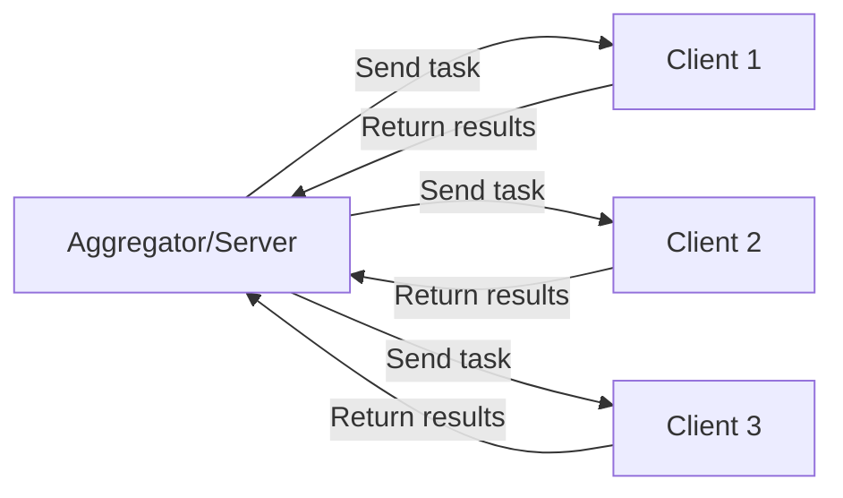

## Overview

Multi-client setup enables you to deploy federated learning across multiple datasites (data owners) with a central aggregator (data scientist). This guide covers configuration, deployment, and management of distributed FL systems.

## Architecture

### Components

<CardGroup cols={3}>
  <Card title="Aggregator" icon="server">
    Data scientist running the FL server
  </Card>
  <Card title="Datasites" icon="database">
    Data owners with private datasets
  </Card>
  <Card title="Transport" icon="network-wired">
    Communication layer (SyftBox or P2P)
  </Card>
</CardGroup>

### Communication Flow



## Setup Process

### Step 1: Bootstrap Project

Configure your FL project with aggregator and datasites:

```bash
syft_flwr bootstrap /path/to/flower-project \
  --aggregator data-scientist@university.edu \
  --datasites hospital1@med.org,hospital2@clinic.com,hospital3@health.gov
```

This creates a `pyproject.toml` with:

```toml
[tool.syft_flwr]
app_name = "data-scientist@university.edu_my-fl-project_1234567890"
aggregator = "data-scientist@university.edu"
datasites = [
    "hospital1@med.org",
    "hospital2@clinic.com",
    "hospital3@health.gov"
]
transport = "syftbox"
```

### Step 2: Distribute Project

Each participant needs the project code:

```bash
# Package the project
tar -czf my-fl-project.tar.gz my-fl-project/

# Distribute to all participants
scp my-fl-project.tar.gz hospital1@med.org:/projects/
scp my-fl-project.tar.gz hospital2@clinic.com:/projects/
scp my-fl-project.tar.gz hospital3@health.gov:/projects/
```

### Step 3: Install Dependencies

Each participant installs the project:

```bash
# On each datasite
cd /projects/my-fl-project
pip install -e .
```

## Running the Aggregator

### Start the Server

On the aggregator machine:

```bash
cd /path/to/my-fl-project
python main.py --server
```

Or explicitly:

```bash
python main.py -s
```

### Server Implementation

```python
# run.py:48-73
def syftbox_run_flwr_server(flower_project_dir: Path) -> None:
    pyproject_conf = load_flwr_pyproject(flower_project_dir)
    datasites = pyproject_conf["tool"]["syft_flwr"]["datasites"]
    server_ref = pyproject_conf["tool"]["flwr"]["app"]["components"]["serverapp"]
    app_name = pyproject_conf["tool"]["syft_flwr"]["app_name"]
    
    context = Context(
        run_id=uuid4().int,
        node_id=uuid4().int,
        node_config=pyproject_conf["tool"]["flwr"]["app"]["config"],
        state=RecordDict(),
        run_config=pyproject_conf["tool"]["flwr"]["app"]["config"],
    )
    
    server_app = load_app(
        server_ref,
        LoadServerAppError,
        flower_project_dir,
    )
    
    syftbox_flwr_server(
        server_app=server_app,
        context=context,
        datasites=datasites,
        app_name=app_name,
        project_dir=flower_project_dir,
    )
```

### Server Logs

```bash
# Monitor server activity
tail -f server.log

# Expected output:
# INFO: Started SyftBox Flower Server on: data-scientist@university.edu
# INFO: syft_flwr app name: data-scientist@university.edu_my-fl-project_1234567890
# INFO: Waiting for nodes to connect...
# INFO: Sampled 3 nodes (out of 3)
# INFO: Received 3/3 results
```

## Running Clients

### Start Clients

On each datasite:

```bash
cd /path/to/my-fl-project
python main.py  # Default: runs as client
```

### Client Implementation

```python
# run.py:22-45
def syftbox_run_flwr_client(flower_project_dir: Path) -> None:
    pyproject_conf = load_flwr_pyproject(flower_project_dir)
    client_ref = pyproject_conf["tool"]["flwr"]["app"]["components"]["clientapp"]
    app_name = pyproject_conf["tool"]["syft_flwr"]["app_name"]
    
    context = Context(
        run_id=uuid4().int,
        node_id=uuid4().int,
        node_config=pyproject_conf["tool"]["flwr"]["app"]["config"],
        state=RecordDict(),
        run_config=pyproject_conf["tool"]["flwr"]["app"]["config"],
    )
    
    client_app = load_app(
        client_ref,
        LoadClientAppError,
        flower_project_dir,
    )
    
    syftbox_flwr_client(
        client_app=client_app,
        context=context,
        app_name=app_name,
        project_dir=flower_project_dir,
    )
```

### Client Logs

```bash
# Monitor client activity
tail -f client.log

# Expected output:
# INFO: Started SyftBox Flower Client on: hospital1@med.org
# INFO: syft_flwr app name: data-scientist@university.edu_my-fl-project_1234567890
# INFO: 📥 ENCRYPTED Received request, size: 2.34 MB
# INFO: 🔓 Successfully decrypted message
# INFO: Processing message with metadata: ...
# INFO: 🔒 Preparing ENCRYPTED reply, size: 1.87 MB
```

## Data Management

### Client Data Structure

Each client should organize their data:

```bash
# On hospital1@med.org
/data/
└── hospital1/
    ├── train.csv
    ├── test.csv
    └── metadata.json

# On hospital2@clinic.com
/data/
└── hospital2/
    ├── train.csv
    ├── test.csv
    └── metadata.json
```

### Loading Client Data

```python
# client_app.py
from pathlib import Path
import pandas as pd
from syft_flwr.utils import run_syft_flwr, get_syftbox_dataset_path

def load_data():
    """Load data for this client."""
    if not run_syft_flwr():
        # Running in standard Flower mode
        return load_flwr_data(partition_id, num_partitions)
    else:
        # Running with Syft-Flwr
        data_dir = get_syftbox_dataset_path()
        
        df_train = pd.read_csv(data_dir / "train.csv")
        df_test = pd.read_csv(data_dir / "test.csv")
        
        return pd.concat([df_train, df_test], ignore_index=True)
```

### Setting Data Path

<Tabs>
  <Tab title="Environment Variable">
    ```bash
    # On each client machine
    export DATA_DIR=/data/hospital1
    python main.py
    ```
  </Tab>

  <Tab title="Systemd Service">
    ```ini
    # /etc/systemd/system/fl-client.service
    [Unit]
    Description=FL Client for Hospital 1
    After=network.target

    [Service]
    Type=simple
    User=flclient
    WorkingDirectory=/projects/my-fl-project
    Environment="DATA_DIR=/data/hospital1"
    ExecStart=/usr/bin/python main.py
    Restart=always

    [Install]
    WantedBy=multi-user.target
    ```

    ```bash
    sudo systemctl enable fl-client
    sudo systemctl start fl-client
    ```
  </Tab>

  <Tab title="Docker">
    ```yaml
    # docker-compose.yml
    version: '3.8'
    services:
      fl-client:
        image: my-fl-project:latest
        environment:
          - DATA_DIR=/data
        volumes:
          - /data/hospital1:/data:ro
        command: python main.py
        restart: unless-stopped
    ```

    ```bash
    docker-compose up -d
    ```
  </Tab>
</Tabs>

## Encryption and Security

### Key Bootstrap

For SyftBox transport, encryption keys are automatically generated:

```bash
# On each participant machine
~/.syftbox/
├── {email}_private_key.pem  # Private encryption key
└── {email}_config.json       # SyftBox config

~/datasites/{email}/
└── did.json                  # Public DID document
```

### Verifying Encryption

Check that encryption is enabled:

```python
# In client/server logs:
# ✅ Expected (encrypted):
INFO: 🔐 End-to-end encryption is ENABLED for FL messages
INFO: 🔒 Preparing ENCRYPTED reply, size: 2.34 MB
INFO: 🔓 Successfully decrypted message

# ⚠️ Warning (not encrypted):
WARNING: ⚠️ End-to-end encryption is DISABLED for FL messages
```

### DID Document Access

Participants must be able to read each other's DID documents:

```bash
# Server can read client DIDs
ls ~/datasites/hospital1@med.org/did.json
ls ~/datasites/hospital2@clinic.com/did.json

# Clients can read server DID
ls ~/datasites/data-scientist@university.edu/did.json
```

## Monitoring and Management

### Checking Connected Clients

```python
# server_app.py
from flwr.server import ServerApp, Grid
from flwr.common import Context

app = ServerApp()

@app.main()
def main(grid: Grid, context: Context) -> None:
    # Get all connected clients
    all_node_ids = list(grid.get_node_ids())
    logger.info(f"Connected clients: {len(all_node_ids)}")
    
    # Wait for minimum number of clients
    min_clients = 2
    while len(all_node_ids) < min_clients:
        logger.info(f"Waiting for clients... ({len(all_node_ids)}/{min_clients})")
        time.sleep(5)
        all_node_ids = list(grid.get_node_ids())
```

### Health Checks

```python
# Check if a client is responsive
def check_client_health(grid: Grid, node_id: int) -> bool:
    """Send a ping message to check if client is alive."""
    try:
        ping_message = Message(
            content=RecordDict({"action": "ping"}),
            message_type=MessageType.SYSTEM,
            dst_node_id=node_id,
            group_id="health_check",
        )
        
        replies = grid.send_and_receive([ping_message], timeout=30.0)
        return len(replies) > 0 and not replies[0].has_error()
    except Exception as e:
        logger.error(f"Health check failed for node {node_id}: {e}")
        return False
```

### Graceful Shutdown

Stop all clients from the server:

```python
# fl_orchestrator/flower_server.py:50-51
finally:
    syft_grid.send_stop_signal(group_id="final", reason="Server stopped")
    logger.info("Sending stop signals to the clients")
```

## Scaling to Many Clients

### Sampling Strategies

For large-scale deployments, sample a subset of clients per round:

```python
import random

@app.main()
def main(grid: Grid, context: Context) -> None:
    num_rounds = context.run_config["num-server-rounds"]
    fraction_sample = context.run_config.get("fraction-sample", 0.1)
    
    for server_round in range(num_rounds):
        # Get all available clients
        all_node_ids = list(grid.get_node_ids())
        
        # Sample a fraction
        num_to_sample = max(2, int(len(all_node_ids) * fraction_sample))
        sampled_nodes = random.sample(all_node_ids, num_to_sample)
        
        logger.info(
            f"Round {server_round + 1}: Sampled {len(sampled_nodes)}/{len(all_node_ids)} clients"
        )
        
        # Send tasks only to sampled clients
        messages = create_messages_for_nodes(sampled_nodes, server_round)
        replies = grid.send_and_receive(messages)
```

### Configuration

```toml
# pyproject.toml
[tool.flwr.app.config]
num-server-rounds = 100
fraction-sample = 0.2        # Sample 20% of clients per round
min-available-clients = 5    # Need at least 5 clients
min-sample-size = 2          # Sample at least 2 clients
```

## Example: Three-Hospital Deployment

### Project Configuration

```bash
# Bootstrap
syft_flwr bootstrap ./diabetes-fl \
  --aggregator researcher@university.edu \
  --datasites hospital-a@med.org,hospital-b@clinic.com,hospital-c@health.gov
```

### Deployment Steps

<Steps>
  <Step title="Prepare Infrastructure">
    ```bash
    # On researcher@university.edu
    cd /projects/diabetes-fl
    pip install -e .
    
    # On hospital-a@med.org
    cd /projects/diabetes-fl
    pip install -e .
    export DATA_DIR=/data/hospital-a
    
    # On hospital-b@clinic.com
    cd /projects/diabetes-fl
    pip install -e .
    export DATA_DIR=/data/hospital-b
    
    # On hospital-c@health.gov
    cd /projects/diabetes-fl
    pip install -e .
    export DATA_DIR=/data/hospital-c
    ```
  </Step>

  <Step title="Start Clients First">
    ```bash
    # On each hospital
    python main.py &
    
    # Verify client started
    tail -f client.log
    # INFO: Started SyftBox Flower Client on: hospital-a@med.org
    ```
  </Step>

  <Step title="Start Server">
    ```bash
    # On researcher machine
    python main.py --server
    
    # Monitor progress
    tail -f server.log
    # INFO: Waiting for nodes to connect...
    # INFO: Sampled 3 nodes (out of 3)
    ```
  </Step>

  <Step title="Monitor Execution">
    ```bash
    # Check all logs
    # Server:
    tail -f /projects/diabetes-fl/server.log
    
    # Clients:
    ssh hospital-a@med.org 'tail -f /projects/diabetes-fl/client.log'
    ssh hospital-b@clinic.com 'tail -f /projects/diabetes-fl/client.log'
    ssh hospital-c@health.gov 'tail -f /projects/diabetes-fl/client.log'
    ```
  </Step>
</Steps>

## Troubleshooting

### Clients Not Connecting

**Symptom**: Server shows "Waiting for nodes to connect..."

**Solutions**:

1. Verify clients are running:
   ```bash
   ps aux | grep "python main.py"
   ```

2. Check client logs for errors:
   ```bash
   tail -50 client.log
   ```

3. Verify SyftBox is syncing:
   ```bash
   ls ~/datasites/{aggregator_email}/flwr/{app_name}/
   ```

### Messages Not Encrypting

**Symptom**: Logs show "PLAINTEXT" instead of "ENCRYPTED"

**Solutions**:

1. Check encryption setting:
   ```bash
   echo $SYFT_FLWR_ENCRYPTION_ENABLED  # Should be "true" or empty
   ```

2. Verify DID documents exist:
   ```bash
   ls ~/datasites/*/did.json
   ```

3. Re-bootstrap encryption:
   ```bash
   rm -rf ~/.syftbox/*_private_key.pem
   python main.py  # Will regenerate keys
   ```

### Client Can't Load Data

**Symptom**: "FileNotFoundError: Path .data/ does not exist"

**Solutions**:

1. Set DATA_DIR:
   ```bash
   export DATA_DIR=/path/to/client/data
   ```

2. Verify data exists:
   ```bash
   ls $DATA_DIR/train.csv
   ls $DATA_DIR/test.csv
   ```

### Performance Issues

**Symptom**: Slow communication or timeouts

**Solutions**:

1. Reduce message size (use model compression)
2. Increase timeouts in config
3. Sample fewer clients per round
4. Check network connectivity between participants

## Production Deployment

### Systemd Service Template

```ini
# /etc/systemd/system/fl-client@.service
[Unit]
Description=Federated Learning Client for %i
After=network-online.target syftbox.service
Wants=network-online.target

[Service]
Type=simple
User=flclient
Group=flclient
WorkingDirectory=/projects/fl-project
Environment="DATA_DIR=/data/%i"
Environment="SYFT_FLWR_ENCRYPTION_ENABLED=true"
ExecStart=/usr/bin/python3 main.py
Restart=always
RestartSec=10
StandardOutput=journal
StandardError=journal

[Install]
WantedBy=multi-user.target
```

```bash
# Enable and start
sudo systemctl enable fl-client@hospital1
sudo systemctl start fl-client@hospital1

# Check status
sudo systemctl status fl-client@hospital1
sudo journalctl -u fl-client@hospital1 -f
```

## Next Steps

<CardGroup cols={2}>
  <Card title="Run Simulations" icon="flask" href="/guides/run-simulations">
    Test multi-client setup locally
  </Card>
  <Card title="Offline Training" icon="cloud-arrow-down" href="/guides/offline-training">
    Handle intermittent client availability
  </Card>
  <Card title="Transport Configuration" icon="network-wired" href="/guides/transport-configuration">
    Optimize communication layer
  </Card>
</CardGroup>